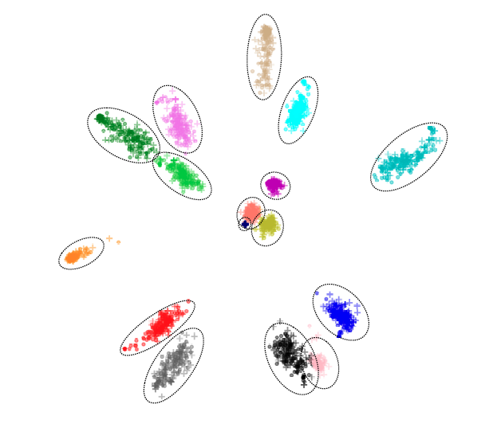

​	Although it seems difficult for normal people to acquire more than two languages, according 
to the Wikipedia there are many polyglots who can speak tens of languages. For example, 
Ziad Fazah, speaking a total of 59 world languages, is believed to be the world’s greatest living polyglot.
However, compared with others in the history his record does not stand out. It was recorded that 
Cardinal Giuseppe Caspar Mezzofanti, who was born in 1774, could speak 38 languages and 40 dialects. 
Meanwhile, the 10th-century Muslim polymath Al-Farabi was claimed to know 70 languages. The German Hans 
Conon von der Gabelentz, born in 1807, researched and published books about grammars for 80 languages. 
The highest record probably belongs to Sir John Bowring, Governor of Hong Kong from 1854 to 1859,
who was said to know 200 languages, and capable of speaking 100. But it turns out extremely difficult 
for machine to learn natural languages like humans, in particular, despite its huge potential applications,
speech translation has always been a challenge for machine.
One common advantage is that those polyglots all benefit from not only text, but also audio corpus. However,
how to utilize both audio and text information to help machine speech translation has not been fully exploited.
The challenge comes from the intrinsic difference of modality between audio and text.

Reading Time: About 15 minutes.

Paper：<https://arxiv.org/pdf/2105.03095.pdf>

Github: <https://github.com/Glaciohound/Chimera-ST>

<!-- more -->

## Introduction

A recent work Chimera from ByteDance AI Lab and UIUC aims to draw strengths from both modalities 
for speech translation [1]. Their key idea is to represent text and audio inputs differently, 
then fuse them together by projecting audio and text features into a common semantic representation
to boost the ST performance.

There are two main advantages for including audio and text data together for training one ST model.
First, humans learn languages simultaneously from audio, text and videos rather than pure text. Inspired by
this observation, it is believed that text knowledge can provide additional insights for ST. Second, 
since MT corpus is much larger compared with small corpus of ST, which is also expensive to create, 
incorporating MT text provides much fruitful training data and is expected to yield improvements on ST 
when bridging the modality gap properly. 

Taking those benefits into consideration, the Chimera model showed significant improvements by unifying MT and ST
tasks on the benchmark ST datasets containing more than ten languages pairs.

Unlike previous translation models, Chimera has established a successful paradigm of 
bridging the modality gap between text and audio for speech translation. 
This is similar to multi-modality MT, in which images can improve the text translation quality. Considering
the pixel level information in images is accurately described, the audio is even noisier and leads to more challenges.

Chimera is designed for an end-to-end speech-to-text translation task. It has two advantages. 
First, the translation quality can be consistently improved by leveraging a large amount of external 
machine translation data. In rich-resource directions, such as the largest speech translation dataset 
MuST-C, which already contains translations from English to eight languages with each pair 
consisting of at least 385 hours of audio recordings, Chimera can still significantly improve the 
quality, reaching a new State-Of-The-Art(SOTA) BLEU score on all language pairs. In low-resource 
directions, such as LibriSpeech dataset containing only 100 hours of training data, Chimera also 
performs surprisingly well and consistently outperforms the previous best results.
Finally, they verified the common knowledge conveyed between these audio and text tasks indeed comes
from the shared semantic space and thus paves a new way for augmenting training resources across modalities.

Chimera can be thought of as a multimodal in the field of speech translation in general.
When you need to develop a speech translation model but don't have enough audio data, you
may consider using Chimera, and it can turn out to be better than your expectation!
The research data, codes and resources are also kindly published by the authors.

Next, we will introduce and analyze Chimera from three aspects: 1) the challenges of bridging the gap 
between audio and text for speech translation; 2) the motivation and methods of Chimera; 3) the 
performance and analysis of Chimera.

## Challenges in speech translation
The current paradigm of artificial intelligence highly depends on training on a large dataset, and thus
make predictions on a small test set. However, different modalities of data have been labeled for
various tasks but seldom been utilized together due to the modality gap of data representations. For example,
billions of parallel MT corpora have been ignored as additional training data for SP for a long time.
At the meanwhile, the data of ST is always in the dearth due to the difficulty of collection 
and high cost. Looking at the relatively smaller amount of parallel data for ST compared with MT,
it is natural to have the idea of combining them together. Unfortunately, although they both encode human
languages, they are dissimilar in both coding attributes(pitch, volume, and intonation versus words, 
suffixes, and punctuation) and length(thousands of time frames versus tens of words). Therefore, it has 
always been a challenge to unify representations from audio and text. The recent evidence from functional 
neuroimaging identifies certain regions in brain that the processing stream for speech sounds and visual
text correlates positively with the subjects' reading ability. This finding provides the intuition 
for developing a multi-modality converged representation of audio and text in language activities. But 
only little previous research explored this direction possibly due to the difficulties of modality fusion and
marginal improvements. Surprisingly, Chimera establishes a new bridge to fill the modality gap between 
speech and text and can serve as a new foundation in this area.

In the above figure[2], the color represents relative contribution of unimodal visual (green), unimodal auditory
(red), and similar contribution of visual and auditory predictors (yellow) to explaining signal variance. 
The lateral and inferior occipital-temporal cortex were active by unimodal presentation of letters, while
Heschl's gyrus (primary auditory cortex) and portions of the superotemporal cortex were activated by 
unimodal presentation of speech sounds. This neuroimaging evidence convinces the connection of audio and text in human
brain, serving as theoretical foundation of modality fusion.

## Motivation and Techniques of Chimera

​For language learners, a very interesting phenomenon is that they learn better by audio and text 
together rather than text only. The aforementioned famous polyglots also stated that their success 
originated from various interactions with native speakers in other languages, such as listening, 
reading, and speaking. Nowadays, many people also learn new languages by watching movies, in which
they will be immersed in audio and subtitles. In particular, the above figure is Ioannis Ikonomou, who was born 
in Greek and now works as translator for European Union. Ikonomou can speak 32 languages and could also translate
those languages to each other in daily work. According to his interview, he was born in a famous tourism city,
where people from all over tha world visit there every day. Under the influence of different tourists, 
he learned English at 5 years old, German at 7 years old, Italian at 10 years old, Russian at 13 years 
old, East African Swahili at the age of 14, and Turkish at the age of 16. He said "Learning Polish 
can make Polish dumplings better. Learning Russian is to understand Dostoyevsky,
Persian is to appreciate ancient Persian poetry, and Hungarian is to understand Hungarian folk 
songs. For German, it is to understand the veteran show "Mirror of the World" every Sunday evening."[3].
It is worthy to point that he learned most languages when he was still a child, demonstrating strong language ability
of human children.

The above figure shows the developmental milestones of human children learners. Children first learns
how to speak from their family and thus how to speak fluently, read and write formally at school.

All those evidence demonstrates that combining audio and text could help humans learn a new language.
A natural next step is to apply this idea in speech machine translation.

The design goal of Chimera is based on such considerations: design a general framework 
to learn the combination of audio and text from languages, and then it will benefit from this 
combined pre-training when migrating to the new speech translation direction. Just like language
learners, after learning two modalities, the one modality becomes easier. The design of Chimera
follows three basic principles: first, learn the shared semantic memory module to bridge the gap 
between the representation of audio and text; Second, the training objective of pre-training comes from three 
parts: 1) the speech-to-text translation training, 2) the text machine translation training, 
and 3) Bi-modal contrastive training; Third, train on external MT corpora and then apply the model
in ST task.

## Shared semantic memory

Chimera follows a transformer based encoder-decoder framework and above is an overview. Word 
embedding for text input and the Wav2vec2[4] sub-module for speech input 
are both included in the Encoder Module. The shared semantic projection Module generates 
semantic memory with fixed-size representation from contextual features using its memory query.
The Decoder Module decodes semantic memory translation.

Since the encoder and decoder are actually standard modules based on transformer[5], which have been proven 
to be the SOTA design in many natural language processing tasks, the shared semantic memory module is
the key to success of Chimera. So here we will mainly discuss the fantastic design of this shared module.
Among this framework, the module relies heavily on shared semantic projection. In fact, contextual elements of speech
and text can have a wide range of distributions and lengths. The shared semantic projection should, 
in theory, compute a fixed number of semantic features as output semantic memories.
This module takes the contextual information extracted from the encoding module as input and 
outputs semantic memories with a set length of m. It is made up of n layers of attention. It 
stores a tuple of m trainable input-dependent memory queries as the initial "memories" to 
represent the categories of required semantic information. Attention "keys" and "values" are
provided by unimodal contextual features, but attention "queries" are provided by memories.
Memories are fed into the n shared semantic projection layers in an iterative fashion, 
with each layer's output being used as input to the next layer. The semantic memory is created
from the final output.

## Dataset and preprocessing
Two datasets were used for conducting experiments to verify the effectiveness of Chimera.
One is called MuST-C, the largest ST corpus, which contains translations from English(EN) to 8 languages: Dutch (NL), French (FR),
German (DE), Italian (IT), Portuguese (PT), Romanian(RO), Russian (RU), and Spanish (ES). With
each pair consisting of at least 385 hours of audio recordings. Another popular one is Augmented LibriSpeech Dataset
(En-Fr), which is composed of aligned e-books in French and their human reading in English of 100 hours.
They also incorporate data from WMT, OpenSubtitles and OPUS100 translation tasks as pretraining corpora.

In practice, speech input, the 16-bit raw wave sequences are normalized by a factor of 215 to the range of
[-1, 1), which uses the Wav2Vec2 Module following the base configuration in [4].
The shared Transformer encoder consists of 6 layers. The memory queries are 64 512-
dimensional vectors. The parameters of shared semantic  projection resemble a 3-layer Transformer
encoder. The Transformer decoder has 6 layers. Each of these Transformer layers, except for those
in the Wav2Vec2 module, has an embedding dimension of 512, a hidden dimension of 512, and 8
attention heads.

Chimera contains around 165M parameters. The whole training process for one trial on 8 Nvidia Tesla-V100 GPUs
generally takes 20 –40 hours according to the translation direction.

## Effectiveness of Chimera
In summary, Chimera has the following advantages:
1. New state-of-the-art performance on all language pairs

Even though they did not use Google Translate results on Augmented Librispeech as most baselines,
Chimera obtains state-of-the-art performance on all language pairs. Chimera's EN-DE results 
use WMT14+OpenSubtitles for MT pretraining, whereas the original paper also contains a full ablation 
research on the effect of MT data. It's worth noting that the improvement in EN-PT isn't as 
dramatic as it is in EN-DE and EN-FR. This is due to a mismatch in data between OPUS100 and 
MuST-C. OPUS100 has a high amount of sentences from movie subtitles, which are more informal, 
feature repeated lines, and address issues that are not covered in MuST-C public speeches.

2. Successfully share knowledge across tasks

Additional trial findings corroborate their design of auxiliary tasks by demonstrating its 
ability to acquire a well-structured shared semantic space as well as successfully exchange
learned knowledge between MT and ST.

Here are some representative experimental results:

### 1. Benchmark Experiments
The below two tables demonstrate the main results on tst-COMMON subset on all 8 languages in MuST-C dataset
amd on LibriSpeech English-French dataset.

Table 1: Main results on tst-COMMON subset on all 8 languages in MuST-C dataset.

Table 2: Results on LibriSpeech English-French dataset.

### 2. Visualizations

Regardless of the input modality, the shared semantic projection is designed to extract only 
the semantic categories of information required for decoding. To validate this hypothesis, a 
2-dimensional PCA projection was performed in the semantic memories across different samples.

In the above figure, each colored cluster (circled out) represents a semantic memory element. A '.' corresponds to
a speech semantic memory, and a “+” marks a text one. It is obvious that semantic memories are
strongly clustered, with each individual learning a specific region. The model's capacity to 
overlook representation disparities and bridge the modality gap is demonstrated by the close 
distance of speech and text representations inside the same region.

One randomly selected semantic memory subspace was analyzed by PCA to its related cluster to get 
a better look at the structure of each semantic memory subspace.

The above figure is the visualization of one specific semantic memory with no different samples or 
modalities. "+" denotes text representations, while "." denotes speech representations. Marks
of the same color are linked by dashed lines and come from the same speech-transcript pair. 
Some speech-transcript pairs have been circled and their transcripts have been annotated. 
Three different fonts denote three different sets of transcripts with similar patterns.
As can be seen from the circles, the matched speech and transcript inputs are indeed close to each other. 
Such results provide strong evidence of the efficacy of the semantic memory module, especially when
considering audio and text represent different modalities.

## Summary
Going back to the polyglots, who successfully learn new languages through various kinds of interactions 
with the environments such as speaking, reading and writing, Chimera makes one important step towards
drawing strength from text machine translation to advance speech translation.
In general, Chimera unites MT and ST tasks by projecting audio and text data to a shared 
semantic representation, boosting performance on ST benchmarks MuST-C and Augmented 
Librispeech to a new state-of-the-art. Further visualizations show that the shared semantic space does indeed
convey common knowledge between these two tasks, paving the path for novel ways to supplement training materials across modalities.

In the future, we are looking forward to more advanced techniques to solve two additional problems: 1) how to
tightly align speech and text representations and 2) how to make the workflows of MT and ST fully shared. 
Since ST is an exciting new area, there are a lot of interesting research and progress almost every week. 
In the near future, we believe a beautiful new world, where the real time speech translation comes true and the 
language barriers among countries and nations are broken, is waiting fo us.

## References
[1] Han, Chi, Mingxuan Wang, Heng Ji, and Lei Li. "Learning Shared Semantic Space for Speech-to-Text Translation." ACL 2021.

[2]Van Atteveldt, Nienke, Elia Formisano, Rainer Goebel, and Leo Blomert. "Integration of letters and speech sounds in the human brain." Neuron 43, no. 2 (2004): 271-282.

[3] <https://en.wikipedia.org/wiki/Ioannis_Ikonomou>

[4]Alexei Baevski, Yuhao Zhou, Abdelrahman Mohamed, and Michael Auli. 2020. wav2vec 2.0: A framework for self-supervised learning of speech representations. In Advances in Neural Information Processing Systems, volume 33, pages 12449–12460. Curran Associates, Inc.

[5]Vaswani, Ashish, Noam Shazeer, Niki Parmar, Jakob Uszkoreit, Llion Jones, Aidan N. Gomez, Łukasz Kaiser, and Illia Polosukhin. "Attention is all you need." In Advances in neural information processing systems, pp. 5998-6008. 2017.