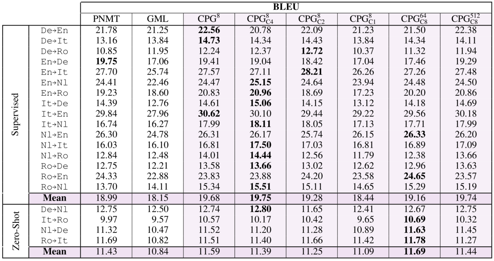

## Introduction
A typical neural machine translation (NMT) system needs to support the translation among various languages, that is, a multilingual(many-to-many) NMT system rather than only support the translation between two languages. However, to support the multilingual translation is still a challenge. One direct idea is to use a separate model to translation one language to another language, which is very easy to implement but brings high costs: To support the translation among N languages, we need train N(N-1)/2 separate models. Such a method does not allow the sharing of information across languages, which can result in overparameterization and sub-optimal in performance. We denote this method as *per-language NMT*

Another method is called *universal NMT*, which use a single model for all language pairs. Compared to the previous method, it shares the parameters among all languages which can avoid overparameterization. However, the universal NMT lacks any language-specific parameterization, which makes it oversimplified. Also, since all languages use the same model, the vocabulary will be very large which makes it hard to scale. How to find a balance between per-language NMT and universal NMT to get a better solution to support the multilingual translation task is still a challenge.

Here we make a quick comparison between different methods for the multilingual translation system. Assume that we need to support the translation among $N$ languages.
|Model|Model Num|Information accross Language|Language-specific Parameterization|Others|
|-|-|-|-|-|
|Per-language NMT|$N(N-1)/2$|False|True|Overparameterization|
|Universal NMT|1|True|False|Oversimplification|
|CPG NMT|1|True|True|-|

To solve this problem, this paper propose a very novel and neat idea: to design a universal neural machine translation. For all language pairs, the model is the same. But a parameter generator will generate bias to the parameters of the model according to the source language and target language. Since the bias is generated according to the type of the language pair, the generation process is called Contextual Parameter Generation (CPG). The method is not only effective in machine translation but can also be adapted to other fields, for example, domain adapatation. As a result, it is of great significance to read and discuss the method of this paper and the insight behind it.

## Preliminary
To make our demonstration clearer, we first make some basic denotations. Assume that we have a set of source languages $S$ and a set of target language $T$, then the total number of langauge pairs will be $|S|*|T|$. We denote the total number of languages as $L = |S\cup T|$. Assume we also have a set of $C \leq |S|*|T|$ pairwise paralleled corpora $\{P_{1}, \dots, P_{C}\}$, each of which contains a set of sentence pairs for a single source-target language conbination. The goal of multilingual NMT is to build a model that, when trained using the provided parallel corpora, can learn to translation well between any pair of languages in $S\times T$.

In this paper, the authors use a seq2seq model for the multilingual translation. We denote the paramter of the encoder, $f_{enc}$, as $\theta_{enc}$ and that of the decoder, $f_{dec}$, as $\theta_{dec}$. The encoder will encode the source sentences and produce an intermediate representation that can later be used by the decoder to generate sentences in the target language. 

## Core Idea: Contextual Parameter Generator
Till now, all modules defined above is under the basic NMT framework and should be relatively easy to understand. In this part, we will introduce the core idea of this paper called parameter generator. For a overall description, we can denote the multilingual translation model proposed by this paper as:
$$\text{Vanilla Seq2seq architecture} + \text{Parameter Generator} \rightarrow \text{Multilingual translation system}$$
This formular reflects that the proposed parameter generator is `model-free`, which means it can be combined with any other models(RNN-based, Transformer-based, etc.) and even other tasks. The basic idea can be describe as follows:
Except the backbone model $f_{enc}$ and $f_{dec}$ with their parameter $\theta_{enc}$ and $\theta_{dec}$, we also have a new model, the parameter generator model $\mathcal{G}$ with parameter $\theta_{\mathcal{G}}$, which will `incluence` the parameter of $f_{enc}$ and $f_{dec}$ according to the source and target language. Denote the source language as $L_{s}$ and the target language as $L_{t}$, we can express the idea as:
$$\theta_{enc}^{*} = \theta_{enc}^{*} \oplus \mathcal{G}(L_{s}), \theta_{dec}^{*} = \theta_{dec}^{*} \oplus \mathcal{G}(L_{t})$$
where $\mathcal{G}$ will output the "influence" to the parameter of the encoder/decoder given the source/target language (for example, Chinese, English, German, etc.), and the $\oplus$ means the way we apply the "influence" to the parameters of the encoder/decoder.

Now based on this, we can imagine how we utilize this idea to design a multilingual translation system. We use `only one` seq2seq model with the same paramters for `all` language pairs. Given a language pair, the parameter generator $\mathcal{G}$ will first generate the "influence" to the encoder and decoder and then modify their parameters to get $\theta_{enc}^{*}$ and $\theta_{dec}^{*}$. After that, we use the encoder/decoder with new parameters to conduct training or testing. Note that the gradient can be backpropagated to the seq2seq model and the parameter generator, thus updating the two models to conduct training.

## Dive deeper: the design of CPG

Now we ellaborate the detailed design of CPG. For the encoder side and decoder side, we have two separate paramter generators denoted as $\mathcal{G}_{enc}$​ and $\mathcal{G}_{dec}$​. The parameter generator does not rely on the specific neural network architecture. For simplification, in this paper the authors define the generators with linear transforms. For each language, we initialize it with an embedding $l_{s}$​ and $l_{t}$​, where $s$​ and $t$​ refer to the encoder side and the decoder side. Then the parameter generation process can be represented as:

$$
\theta_{enc}^{*} = \theta_{enc}^{*} + W_{enc}l_{s}
$$

$$
\theta_{dec}^{*} = \theta_{dec}^{*} + W_{dec}l_{t}
$$

where $l_{s}, l_{t} \in R^{M}, W_{enc} \in R^{P_{enc}\times M}, W_{dec} \in R^{P_{dec}\ times M}$, $M$ is the language embedding size, $P_{enc}$ is the number of paramters of the encoder, and $P_{dec}$ is the number of parameters of the decoder.

One problem of this method can be the number of the parameters of the dense layer (that is, the linear transformation of $W_{enc}$​ and $W_{dec}$​). For example, assume that the number of paramters of the encoder/decoder is 100M (The size of the pre-traiend BART-base model is 139M with 12-layer Transformer encoder/decoder). In this case, if the dimension of the language embedding is 128, the number of the parameters of encoder/decoder will be 12.8B respectively, which can cause a high memory and computational cost. As a result, similar to the trick in ALBERT[1/], the authors propose to use the following method:

$$
\theta_{enc} = W_{enc}P_{enc}l_{s}
$$

where $W_{enc} \in R^{P_{enc}\times M'}, P_{enc} \in R^{M' \times M}$​. By selecting $M'$​​ as a small value, we can lower down the parameter size of the parameter generator. We can find that to support a multilingual machine translation system, the CPG method uses much fewer parameters than the per-language method. Compared to the universal method, although introduce more parameters, the CPG method allows incorporated the language-specific information, thus bringing better performance.

## Experiment and Performance

In this section, we talk about the experiment performance of CPG on multilingual translation tasks. The authors use a two-layer LSTM encoder-decoder model with attention to train the MT model and test the performance on three settings:
    1. Supervised: Use the full corpora to train the CPG model. During training, they first sample a language pair uniformly and then sample a batch of data for that language pair. The authors train two models: one which does not use auto-encoding of monolingual data during training($\text{CPG}^{*}$) and one which does ($\text{CPG}$)
    2. Low-resource. Low-resource setting is similar to the supervised setting, except that the size of the paralleled corpora is limited. Note that for CPG and GMT the full monolingual corpora is used for training.
    3. Zero-shot. Under zero-shot setting, the goal is to evaluate how well a model can learn to translate between language pairs that is has not seen while training. For example, a model trained using the paralleled corpora English-German and English-French will be evaluated in translating between German and French. For the plain pairwise NMT models(PNMT), this can be achiveved by pivoting. That means, in the previous example, we would first translate from German to English and then translate from English to French. In comparison, the proposed CPG method in this paper support zero-shot learning inherently and requires no pivoting. 
For the datasets, the authors select IWSLT-15/17. Using a langauge embedding size of 8, the result on IWSLT-15 dataset is shown below:

The performance is quite impressive, especially considing the result of CPG is achieved with only one model with much less paramters. It consistently outperforms the baselines in all settings including supervised and low-resource. Another experiment is on IWSLT-17 dataset. On this dataset, the authors also conduct ablation study on the language embedding size $M$ and $M^{'}$. We can find that except $M^{'} = 1$, all the CPG models outperforms the baselines.

## Language embeddings

Since the CPG model learns the language embeddings during training, we can explore them to find if the model captures the relations among languages. The figure below shows the result. There are some interesting patterns that indicate that the learned language embeddings are reasonable. For example, German(De) and Dutch (Nl) are most similar on the IWSLT-17 dataseta and Italian(It) and Romanian (Ro) coming second. The authors claim that these relationships agree with linguistic knowledge about these languages and the families they belong to. The embedding similarity can also help discover relationships between languages that were previously unknown. For example, on IWLST-15 dataset, French (Fr) is significantly similar to Vietnamese (Vi), which may caused by the occupation of Vietnam by France during the 19th to 20th centuries. 

## Summary
In this blog, we introduce the basic idea of CPG-based multilingual machine translation model as well as its impressive performance. What's more, such an idea can not only be applied to machine translation but can also be used in other domains. It is very meaningful to put this work to public, which can improve the performance of machine learning models and help promote the low-carbon action since it reduce the parameters of the model and the training cost. We are very excited to incorporate it into our current research to improve the performance of zero-shot learning performance on other tasks.

## Reference
[1]Lan Z, Chen M, Goodman S, et al. Albert: A lite bert for self-supervised learning of language representations[J]. arXiv preprint arXiv:1909.11942, 2019.
[2] Emmanouil Antonios Platanios, Mrinmaya Sachan, Graham Neubig, Tom Mitchell. Contextual Parameter Generation for Universal Neural Machine Translation. EMNLP 2018.

