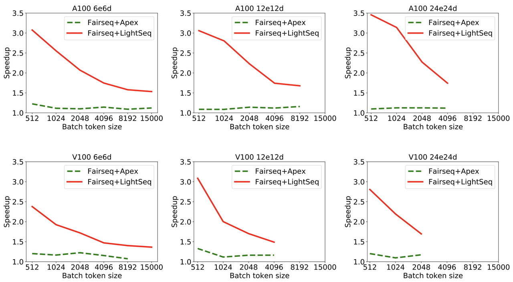
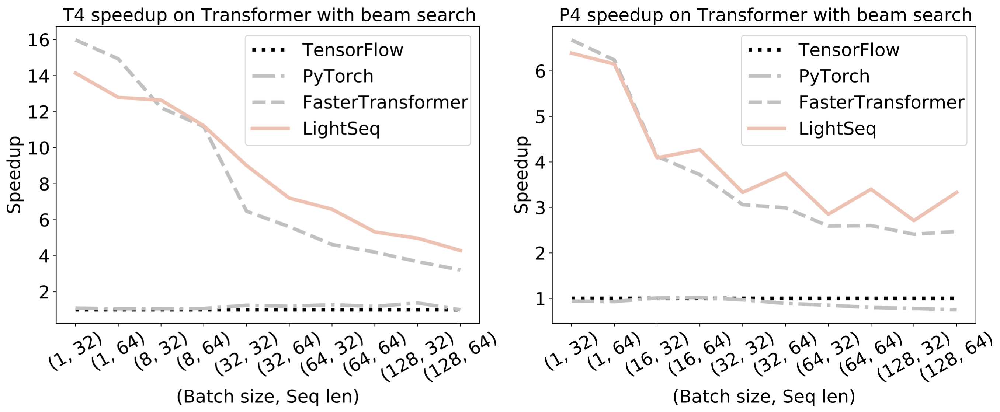
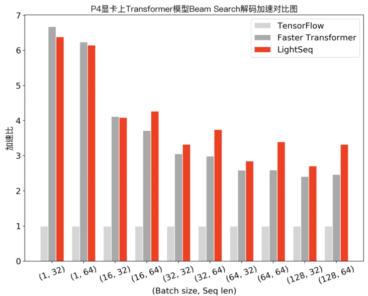

A high performance open-source library for NLP Transformer model training and inferencing. 
<!-- more -->

## 1. What is LightSeq?

### 1.1 NLP models

Transformers[1], BERT[2], or GPT[3] models are state-of-art models on natural language processing tasks. They are heavily used and breaking multiple records on sequence-to-sequence (Seq2Seq) tasks including machine translation, text summarization, and text generation, or even computer vision tasks by Vision Transformers (an image is just a sequence of pixels). However, those models are huge in size that needs large-scale training and inference. This makes it computationally expensive, so serving these models is a challenge for real industrial applications. 

### 1.2 Motivation

Due to the high complexity and large parameter size of transformer models, the latency for both training and inference is high. Here are the three comparisons between the current inference systems and LightSeq, and the reasons why they are not able to perform well for online tasks.

1. Popular deep learning frameworks. Since those models have flexible model structures, both TensorFlow and PyTorch need additional memory allocation and extra overhead for training. Thus, they do not make full use of the hardware resource. 
2. Inference optimization frameworks. Optimization frameworks like TensorFlow XLA, TVM, and TensorRT are not suitable for variable-length inputs, which require dynamic memory allocation that does not perform well for transformer models. 
3. Similar acceleration frameworks. Faster-Transformer and TurboTransformers are similar to LightSeq. However, they do not have all components or features compared to LightSeq (Table 1).

### 1.3 Lightseq

LightSeq[4], is a high-performance open-source library for both training and inference that is directly built on top of CUDA official libraries ([cuBLAS](https://docs.nvidia.com/cuda/cublas/index.html), [Thrust](https://docs.nvidia.com/cuda/thrust/index.html), [CUB](http://nvlabs.github.io/cub/)). 
It supports models in the Transformer family including BERT, GPT, and full encoder-decoder.
It introduces new transformer encoders and decoders components after fusing and optimizing the existing models. 

The applications of LightSeq include Machine Translation, Text Generation, Dialog, Language Modelling, Sentiment Analysis, and other related tasks with sequence data, which can be easily deployed to commercial products. 

LightSeq improves the speed for both training and inference stages. Models like DeepSpeed[5] only accelerate the training, and tools like TensorRT,  FasterTransformer, or TurboTransformers only support optimizing the inference. Here are the comparison tables on different features between LightSeq and other models.

Table 1. The tables above are from the [official Github repository](https://github.com/bytedance/lightseq).

## 2. Technique Details

There are three main methods that LightSeq uses to optimize the model, training speed, and inference speed. The image below shows the architecture of a sequence-to-sequence model using transformers.  

### 2.1 Operation Fusion

Transformers model implemented by popular deep learning frameworks like Pytorch or Tensorflow just combine multiple fine-grained kernel functions for one layer. In this way, it needs to launch more kernel functions and uses lots of memory I/O that costs extra time for training and inference.  

LightSeq uses general matrix multiply (GEMM) and custom kernel functions, so here are only six custom kernel functions and six GEMM in a Transformer encoder layer for LightSeq models. The right image shows the model structure of the LightSeq transformer encoder layer.

*Need to add more intuitive description here*

### 2.2 Hierarchical Auto-Regressive Search

Searching usually happens in the last step of a transformer model. Redundant calculations often exist in output layers since we only need a few labels/tokens with the highest probability instead of all of them. 

LightSeq optimizes this process by using a Hierarchical Auto Regressive Search method to erase redundant calculations and perform parallel computing illustrated as below (using beam search as an example). 

 the following steps happen for each beam.

1. Randomly divide logits into k groups
2. Calculate the maximum of group $i$, denoted
as $m_i$
3. Calculate the minimum of $m_i$, denoted as $R$,
which can be regarded as a rough top-k value of logits.
4. Select logits larger than $R$ and write them into GPU memory.

### 2.3 Dynamic GPU Memory Reuse

LightSeq pre-defines the maximum of dynamic shapes, such as the maximal sequence length, to avoid memory allocation time and save GPU memory occupancy. Also, GPU memory is shared for non-dependent intermediate results to reduce the memory usage. 

By using LightSeq, users are able to 8 Transformer big models simultaneously on a NVIDIA Tesla T4 GPU.

## 3. Using LightSeq

Running LightSeq requires one or more GPUs.

### 3.1 Installation

LightSeq installation from PyPI only supports python 3.6 to 3.8 on Linux for now. Consider compiling from source if you have other environments.

`pip install lightseq fairseq sacremoses transformers`

### 3.2 Training examples using LightSeq

Training a translation task on wmt14 en2de dataset by running the following command.

`sh examples/training/fairseq/ls_fairseq_wmt14en2de.sh`

If you want to run the training using FairSeq, run the following command.

`sh examples/training/fairseq/fairseq_wmt14en2de.sh`

### 3.3 Inference examples Using LightSeq

`pip install torch tensorflow transformers lightseq`

`cd examples/inference/python`

`python export/hf_bart_export.py`

`python test/ls_bart.py`

[Here](https://github.com/bytedance/lightseq/blob/master/docs/guide.md) is a guide on using LightSeq for training and inference.

## 4. Performance

### 4.1 Training Performance

The plots below are the experiment results on WMT14 English to German translation tasks using Transformer-Big models. In all plots, FairSeq+LightSeq models are able to improve the performance to 3.5X maximum. 

The image above is from the [official Github repository](https://github.com/bytedance/lightseq).

### 4.2 Inference Performance

Here are the inference results using LightSeq, TensorFlow, PyTorch, and FasterTransformer on neural machine translation using Transformer-base models with beam search methods.

The image above is from the [official Github repository](https://github.com/bytedance/lightseq).

### 4.3 More Inference Performance on Nvidia P4 and T4

The three images below are from the [Volctrans Blog on segmentfault.com](https://segmentfault.com/a/1190000038523998).

X-axes are the Batch size and sequence length pairs, and Y-axes are the acceleration rates.

### 4.4 Real-world Cloud Computing Delay Test on GPT

This plot shows the performance of deploying a GPT model to cloud computing. At 11:00, the delay performance decreased from 360 ms to 80 ms when LightSeq is turned on. 

The image above is from the [Volctrans Blog on segmentfault.com](https://segmentfault.com/a/1190000038523998).

## 5. Reference

[1] Vaswani, Ashish, et al. "Attention is all you need." Advances in neural information processing systems. 2017.

[2] Devlin, Jacob, et al. "Bert: Pre-training of deep bidirectional transformers for language understanding." *arXiv preprint arXiv:1810.04805* (2018).

[3] Brown, Tom B., et al. "Language models are few-shot learners." arXiv preprint arXiv:2005.14165 (2020).

[4] Wang, Xiaohui, et al. "LightSeq: A High Performance Inference Library for Transformers." arXiv preprint arXiv:2010.13887 (2020).

[5] Jeff Rasley, Samyam Rajbhandari, Olatunji Ruwase, and Yuxiong He. (2020) DeepSpeed: System Optimizations Enable Training Deep Learning Models with Over 100 Billion Parameters. [In Proceedings of the 26th ACM SIGKDD International Conference on Knowledge Discovery & Data Mining (KDD '20, Tutorial)](https://dl.acm.org/doi/10.1145/3394486.3406703).