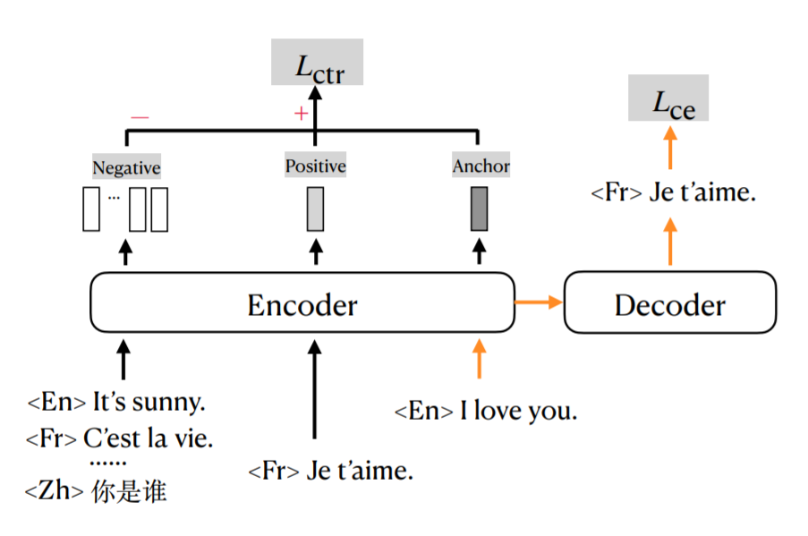
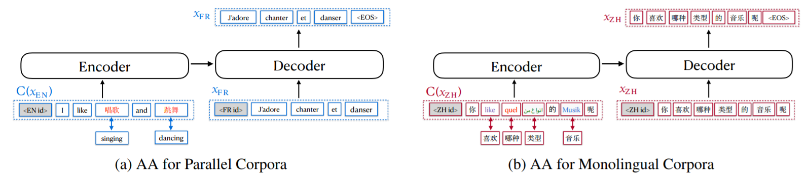

How to develop a single unified model to translate from any language to any language?
This work proposes a many-to-many translation system with emphasis on both English-centric and non-English directions. Many recent works have focused on proposing a single unified model for multiligual translation. These models are favorable because they are efficient and easy for deployment. However, most of these works focus on improving English-centric directions, which means that translation between two arbitrary languages may not be well supported. Therefore, in this paper, they propose a training method called mRASP2, including contrastive learning and alignment augmentation (AA) to train a unified multilingual translation system.  They also contribute a monolingual dataset called MC24. By making use of monolingual and bilingual language copora, the system is able to learn language-agnostic representation to support non-English directions better than before. Their system achieves great performances and outperforms a strong Transformer baseline by a large margin.

<!-- more -->

# Method
## Baseline
The base model of mRASP2 is the Transformer model. They apply a 12-layer encoder and 12-layer decoder, 1024 hidden dimension, and 16 heads. This increases the model capacity to be trained on multilingual translation that can be seen as a many-to-many mapping function. Layer normalization and pre-norm residual connection are also applied. Last but not least, special language identification token is added to both source and target side, at the beginning of each sentence. 

## Multilingual Contrastive Learning

The idea of contrastive learning is to provide a pair of positive samples and a pair of negative samples. Intuitively, the model must learn to project the inputs into a space where the positive pairs are close to each other, while the negative pairs are far away.  Since multilingual translation is considered, the transformer model should learn a shared representation across different languages. For example, "\<En\>I love you" and "\<Fr\> Je t'aime" have the same meaning. Therefore, the model encoder should project them as two adjacent vectors in the high-dimensional embedding space. On the other hand, "\<Zh\>你是谁" has a complete different meaning and should stay away from the two vectors in the space. 

Formally, if we denote the anchor (i.e. source sentence) vector as $R(x^i)$, the positive sample (i.e. target sentence) as $R(x^j)$, the negative sample (i.e. target sentence of another sample) as $R(y^j)$. We can have the following contrastive loss to optimize where $sim(\cdot, \cdot)$ adoptes the dot product to measure the similarity:
$$L_{ctr}=-\sum_{x^i, x^j\in D}log \frac{e^{sim(R(x^i), R(x^j))/\tau}}{\sum_{y^j} e^{sim(R(x^i), R(y^j))/\tau}}$$
They average the output from the encoder of each token to represent the sentence embedding $R(x)$. $\tau$ is a common "temperature" parameter to control the difficulty to distinguish between positive and negative pairs. 

## Aligned Augmentation

The other important technique proposed in this paper is called "Aligned Augmentation" (AA), distinguisheed from previous "Random Aligned Substitution" (RAS). <strong>AA is essentially a data augmentation method, and also a pretext task in self-supervised training. </strong>

The idea is straightforward -- replacing words in source language as corresponding translation in target languages. As is shown in (a), the word singing is replaced with "唱歌" in Chinese and the output is the French correspondence. You can imagine that the encoder will learn an embedding space where "singing", "唱歌", and "chanter" are close to each other. Similarly, (b) shows the augmentation process of monolingual text. RAS is in fact equivalent to (a) bilingual augmentation, while (b) requires a multilingual synonym dictionary. This multilingual synonym dictionary is crucial because it determines the quality of AA. As is stated in the paper, the authors will release their synonym dictionary. 

# Experiment
## Datasets
Two datasets are considered in their experiments. PC32 is a dataset containing 97.6 million English-centric parallel sentence pairs of 32 languages. In addition, they propose a monolingual dataset called MC24, which contains 1.01 billion. 

As for the evaluation datasets, they use WMT, IWSLT, and OPUS-100 benchmarks for supervised directions. For zero-shot directions, 6 languages are picked from OPUS-100, resulting in 15 language pairs and 30 translation directions. 

## Supervised Direction

The above table shows the performance of mRASP2 in English-centric directions. mRASP2 significantly outperforms the multilingual baseline m-Transformer in all 10 directions. Compared to pre-training and fine-tuned models, mRASP also exceeds their performance in 7/10 direction, almost on par with mRASP in other 3 directions except Fr-En. In the English-centric direction, mRASP2 surpasses bilingual, pre-train & fine-tuned, and multilingual baselines in most directions. 

## Unsupervised Direction

Unsupervised directions mean that one of the language in the pair has only appeared in monolingual corpora. Therefore, only Nl, Pt, and Pl satisfy this assumption and are shown in the table above. We observe that mRASP2 performs much better than m-Transformer baseline and mRASP in this setup. m-Transformer generates reasonable transltion on Nl-En and Pt-En, with 7.0 and 10.7 BLEU score, but completely fails on other directions, especially En-X directions. This is because some similar langauges such as Fr and Es in PC32 is exposed to the model. 

But for other languages, m-Transformer cannot learn an accurate correspondence from monolingual corpora. As a comparison, mRASP2 achieves +14.13 BLEU improvement on average, without explicit supervision signals. In addition, mRASP2 also obtains reasonable performance on Nl<->Pt. This reflects that mRASP2 enables unsupervised translation through a unified framework by incorporating monolingual data (MC24) with parallel data (PC32). 

## Zero-shot non-English Translation

mRASP2 also demonstrates strong performance on zero-shot non-English translation. The question is: can we achieve direct translation between non-English paris when we only have parallel corpus between English and other languages? As can be seen from the table above, mRASP2 significantly outperforms m-Transformer. It even achieves an average of 29.0 BLEU on Zh<->X and 23.6 BLEU on Fr<->X. 

This shows that mRASP2 successfully learns a joint representation of non-English languages even without parallel pairs. The reason is that contrastive learning promotes the language-agnostic sentence representation, and AA helps with word-level joint representation. The introduction of MC24 also helps with learning a universal language-agnostic embedding space. mRASP2 improves the zero-shot translation by a large margin, while maintaining a outstanding performance on English-centric directions.

# Analysis
## What is the importance of each contribution?
The authors also demonstrate the importance of contrastive learning, AA, and MC24 by doing an ablation study. The following table shows their results. We can observe that: (1) Contrastive loss is the main contributor to zero-shot translation. Comparing 1 and 3, CTL hugely improves zero-shot translation quality by almost 10.0 BLEU without harming performance on supervised/unsupervised directions. In fact, both supervised/unsupervised quality is slightly improved with CTL. (2) AA boosts up all 3-ways by over 1.0 BLEU if compare 3 and 4. It can be seen as a stable data augmentation method to improve translation quality on unified multilingual framework. (3) Monolingual dataset, MC24 hugely improves the unsupervised direction translation by nearly 13.0 BLEU, and also other two ways by a certain margin. It is beneficial for the overall unified many-to-many translation system. 

## How is the alignment of different languages in Visualization?
The authors build a dataset called Ted-M from the Ted test set with 15-language parallel data. They obtain the 1-24-dim sentence representation of these synonymous sentences in the embedding space. Then they apply T-SNE to reduce the dimension to 2 and select 3 representative languages: English, German, and Japanese.  As can be seen in the following figure, mRASP2 effectively aligns the semantic space of different languages while m-Transformer cannot align well. The plot depicts the bivariate kernel density estimation on 2 dimension space. If two languages align well, their projected density distribution should overlap with each other by a large amount. 

# Summary
Now we can come to a conclusion of the paper. This paper proposes a unified multilingual translation system called mRASP2 with simple but effective components, including contrastive learning, aligned augmentation, and monolingual datasets. Through comprehensive experimental results, they demonstrate that contrastive learning significantly improves the zero-shot translation quality. Aligned Augmentation is a stable and effective techinque for all translation setups. Monolingual data also improves the performance on unsupervised translation by a large margin. Combining all three techinques, mRASP2 achieves substantial improvements over all translation directions of multilingual NMT. They also showcase the learned language-agnostic representation by visualizing the alignment of different languages in a 2-dimensional space. mRASP2 shows the possibility of a true many-to-many Multilingual NMT that supports translation in all directions. 

# Reference
- Xiao Pan, Mingxuan Wang, Liwei Wu, Lei Li. Contrastive Learning for Many-to-many Multilingual Neural Machine Translation. ACL 2021.