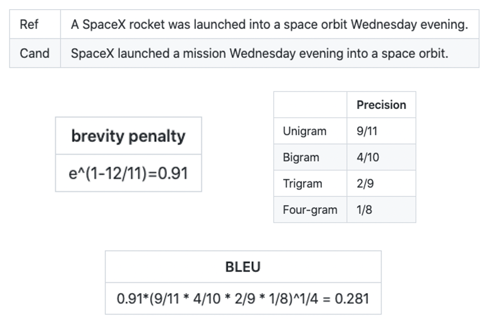
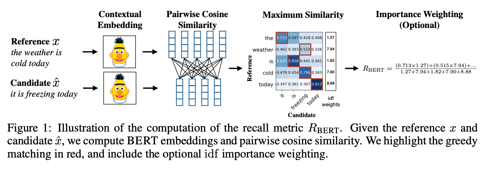
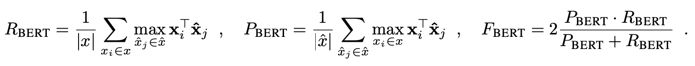
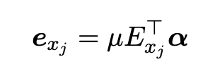
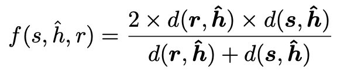

How to automatically evaluate the quality of a machine translation system? Human evaluation is accurate, but expensive. It is not suitable for MT model development. 

Reading Time: About 15 minutes.

<!-- more -->

## A brief history of MT evaluation metrics
### Human evaluation
In 1966, United States, the Automatic Language Processing Advisory Committee (ALPAC) conducted a large scale study on the evaluation of the state-of-the-art Russian-to-English Machine Translation (MT) systems at that time [1]. Indeed, the ALPAC report was infamous for holding a negative opinion toward the development of MT, and caused the suspension of research into related fields for two decodes. However, one of the first practical method for the evaluation of translation quality was developed from the study. Basically, six trained translators were each assigned to evaluate 144 sentences from 4 passages. The evaluation was based on "intelligibility" and "fidelity". "Intelligibility" measures to what extent the sentence can be understood, and "fidelity" measures how much information the translated sentence retained compared to the source. Human evaluation was based on these two variables by giving a score on the scale of 1-9. This is one of the earlest systematic MT evaluation metrics based on human judgement.

### Automatic evaluation
Even though employing human judgement as measuring metric is the most effective approach, purely depending on human is expensive as well as slow in face of the growing size of data, which promoted the need for automation. In 2002, the most commonly used evaluation metric, Bilingual Evaluation Understudy (BLEU), was developed by Kishore et al. [2]. BLEU measures the difference between references  and machine translation candidates through n-grams and brevity penalty. Based on the preliminary that the “highest correlation with monolingual human judgements” is four, n-grams measure the exact word segment correspondence of length one to four in the sentence pair. The brevity penalty is included to avoid short candidates receiving unreasonably high BLEU scores. BLEU remains popular till today due to its light-weightedness and fastness. A simple example [3] of word-level BLEU is demonstrated below.

## BERTScore
Recent works on MT quality evaluation have provided stronger metrics and supports to the increased research interest in neural methods for training MT models and systems. BERTScore, which appeared in the 2020 International Conference on Learning Representations, aims to develop “an automatic evaluation metric for text generation” [4]. As a high level summary, BERTScore is one step forward from the commonly used BLEU, because BERTScore incorporates the additional contextual information into consideration to calculate the degree of difference between source and target sentence. 

### Motivation
Generally speaking, there are two drawbacks in the n-gram-based metrics. Firstly, semantically-correct translations or paraphrases are excessively penalized for the n-gram metrics. In other words, different usage of words on the surface level will result in a low BLEU score. In the paper, the authors give the example of the source reference sentence “people like foreign cars,” and two of the candidates are “people like visiting places abroad” and “consumers prefer imported cars.” The latter uses synonyms to replace certain words in the reference, while preserving the original semantic meanings. However, n-gram-based metrics like BLEU will give higher score to the former candidate, even though the meaning is far from that of the reference sentence, since the exact string match of unigram and bigram values are higher. In face of this pitfall, the BERTScore authors are motivated to break the restrictions of n-grams, and to take advantage of contextualized token embedding as the matching metric, by calculating cosine similarities of all pairs in the reference and candidate.

Secondly, n-gram metrics cannot capture semantic dependencies of distant words or penalize semantically-critical word order changes. For example, for short sentences, BLEU is able to capture the swap of cause and effect clauses, like “A results in B.” However, when A and B are long phrases, even the longest four-gram will fail to capture the cause-effect semantic dependencies of A and B if their order change. The n-gram metrics measures the similarity in a shallow way, which motivates the authros to develop a metric that is more effective in tackling the distant dependencies and ordering problems.

### Technique
The workflow of BERTScore computation is illustrated in the diagram below. Having a reference sentence x tokenized to (x1, …, xk) and a candidate sentence x̂ tokenized to  (x̂1, ..., x̂k), the technique transforms the tokens into contextual imbeddings, and compute the match among all takens by cosine similarity. As an option, multiplying an additional weight based on the inverse document frequency of matching words can be helpful in some scenarios. The outcome includes a precision (R_BERT), recall (P_BERT), and combined metric scores(F1).

BERTScore uses the BERT model to generate contextual embeddings for each token. BERT tokenizes the input text into a sequence of word pieces, and splits the unknown words into commonly observed sequences of characters. The Transformer encoder computes the representation for each word piece by repeatedly applying self-attention and nonlinear transformation alternatively. The resulting contextual embedding from word piece will generate different vector representation for the same word piece in different contexts with regard to surrounding words, which is significantly different from the exact string match metric in BLEU. 

Due to the vector representation of word embedding, BERTScore is able to perform a soft measure of similarity compared to exact-string matching in BLEU. The cosine similarity of a reference token xi and a candidate token x̂j is :

With similarity measurement of each pair of reference token and candidate token in preparation, we can move on to compute precision and recall. In the greedy match perspective, we match each token in x with the highest similarity score in x̂.Recall is computed by matching each token in x to a token in x̂, while precision is by matching each token in x to the corresponding token in x̂. F1 score is calculated by combining precision and recall with the formular listed below. Extensive experiments indicate that F1 score performs reliably well across different settings, and therefore is the most recommended score to be used for evaluation. 

Optionally, we can add an importance weighting to different words to optimize the metric, because previous works indicated that “are words can be more indicative for sentence similarity than common words” [5]. From experiments, apply idf-based weight can render small benefits in some scenarios, but have limited contribution in other cases. The authors use the inverse document frequency (idf) scores to assign higher weights to rare words. Because there is limited preformance improvement when applying importance weighting, details about this optional stage will not be discussed further.

A simple example of BERTScore calculation without importance from the ref-cand cosine similarity matrix is illustrated below. Basically, R_BERT is calculated by the sum of maximum values in each row divided by the number of rows, and P_BERT is calculated by the sum of the maximum values in each column divided by the number of columns. F1 is computed by 2 times the product of R_BERT and P_BERT divided by their sum. The BERTScore with importance weighting can be computed by multiplying the corresponding weight to each cosine similarity.

### Effectiveness
For the evaluation of BERTScore, this blog will focus on the machine translation task in the original paper. The experiment’s main evaluation corpus is the WMT18 metric evaluation dataset, containing predictions of 149 translation systems across 14 language pairs, gold references, and two types of human judgment scores. The evaluation is completed with regard to both segment-level and system-level. The Segment-level human judgment score is for each reference-candidate pair, while the system-level human judgments score is based on all pairs in the test set.

Table below demonstrates the system-level correlation to human judgements. The higher the score is, the closer the system evaluation is to human evaluation. Focusing on FBERT score (F1 score), we can see a large number of bold correlations of metrics for FBERT, indicating it is the top performance system compared to the others. 

Apart from system-level correlation, the table below illustrating the segment-level correlations, BERTScore shows a considerably higher performance compared to the others. The outperformance in segment-level correlations further exhibits the quality of BERTScore for sentence level evaluation.

## COMET
In 2020, Rei et al. presented “a neural framework for training multilingual machine translation evaluation models which obtains new state-of-the-art levels of correlation with human judgements” at the 2020 Conference of Empirical Methods in Natural Language Processing [6]. The system, COMET, employs a different approach in improving evaluation metric. COMET builds an additional regression model to exploit information from source, hypothesis, and reference embeddings, and training the model to give a prediction on the quality of translation that highly correlates with human judgement. 

### Motivation
As the authors point out, “the MT research community still relies largely on outdated metrics and no new, widely-adopted standard has emerged”. This creates motivation for a metric scheme that uses a network model to actually learn and predict how well a machine translation will be in a human rating perspective. We knew that BLEU transformed MT quality evaluation from human rating to automated script, BERTScore improved the evaluation scheme by incoporating context, whereas COMET is motivated to learn how human will evaluate the quality of the translation, specifically scores from direct assessment (DA), human-mediated translation edit rate (HTER), and metrics compliant with multidimensional quality metric framework (MQM). After all, humans are the best to evaluate the translation quality of our own language. In short, COMET aims at closing the gap between automated metric with actual human evaluation.

### Technique
The first step of COMET score computation is to encode the source, MT hypothesis, and reference sentence into token embeddings. The authors take advantage of a pretrained, cross-lingual encoder model, XLM_RoBERTa, to generate the three sequences (src, hyp, ref) into token embeddings. For each input sequence x = [x0, x1, …, xn], the encoder will produce an embedding e_j(l) for each token xj and each layer l ∈ {0, 1, …, k}. 

The word embeddings from the last layer of the encoders are fed into a pooling layer. Using a layer-wise attention mechanism, the information from the most important encoder layers are pooled into a single embedding for each token ej. μ is a trainable weight coefficient, E_j = [e_j(0), e_j(1), ..., e_j(k)] corresponds to the vector of layer embeddings for token xj, and α = softmax([α(1), α(2), . . . , α(k)]) is a vector corresponding to the layer-wise trainable weights.

After applying an average pooling to the resulting word embeddings, a sentence embedding can be concatenated into a single vector from segments. The process is repeated three times for source, hypothesis, and reference sequences. Specifically, two models, the Estimator model and the Translation Ranking model, were developed for different usages.

For the Estimator model, a single vector x is computed from the three sentence embeddings s, h, and r specified below: 

Where h⊙s and h⊙r denotes the element-wise source product and reference product, and |h-s| and |h-r| denotes the absolute element-wise source difference and reference difference. The combined feature x serves as input to a feed-forward regression network. The network is trained to minimize the mean squared error loss between its predicted scores and human quality assessment scores (DA, HTER or MQM).

The Translation Ranking model, on the other hand, has different inputs {s,h+,h-,r}, i.e. a source, a higher-ranked hypothesis h+, a lower-ranked hypothesis h-, and a reference. After transforming them into sentence embeddings **{s,h+,h-,r}**, the triplet margin loss in relation to the source and reference is calculated:

d(u, v) denotes the euclidean distance between u and v and ε is a margin. In this way during training, the model will optimize the embedding space so the distance between the anchors (s and r) and the “worse”
hypothesis h− is larger by at least ε than the distance between the anchors and “better” hypothesis. 

In the inference stage, the model will receive a triplet input (s,ĥ,r) with only one hypothesis, and the quality score will be the harmonic mean between the distance to the source d(s,ĥ) and that to the reference d(r,ĥ), and normalized it to a 0 to 1 range:

In short, the Translation Ranking model is trained to minimize the distance between a “better” hypothesis and both its corresponding reference and its original source. 

 

### Effectiveness
To test the effectiveness of COMET, the authors trained 3 MT translations models that target different types of human judgment (DA, HTER, and MQM) from the corresponding datasets: the QT21 corpus, the WMT DARR corpus, and the MQM corpus. Two Estimator models and one Translation Ranking model are trained. One regressed on HTER (COMET-HTER) is trained with the QT21 corpus, and another model regressed on MQM (COMET-MQM) is trained with the MQM corpus. COMET-RANK is trained with the WMT DARR corpus. The evaluation method employed is the official Kendall’s Tau-like formulation. Concordant is the number of times the metric gives a higher score to the defined "better" hypothesis, while Discordant is the number of times the metrics give a higher score to the "worse" hypothesis or the scores is the same for the two hypothesis.

As shown in table the first table below, for as much as seven in eight language pair evaluation with English as source, COMET-RANK outperforms all other evaluation systems, including BLEU, two encoder models of BERTScore, and its two Estimator models, to a large extent. Similarly, for the language pair evaluation with English as target in the second table below, COMET also exceeds the other metrics in the overall performance, including the 2019 task winning metric YISI-1. 

## Case Study
In order to measure how well BLEU, BERTScore, and COMET can evaluate on existing MT systems, I managed to find a dataset with human judgment scores (e.g DA) [7]. Unfortunately, the MT systems that have the DA score is not available to the public, e.g. I cannot access the Baidu-system.6940 with the highest DA score in WMT19. With this preliminary, the experiment to compare how our evaluation metrics scores with a human judgement score (e.g. DA) is unattainable. Another simpler case study for the metrics is initialized instead.

For the setup, a group of 10 source-reference sentence pairs were prepared from a Chinese-English parallel Yiyan corpus [8]. The source Chinese sentences are fed to two common NMT systems: Google translate which uses Google Neural Machine Translation (GNMT) [9] and SYSTRAN translate [10], and the output of translation is stored as their corresponding hypthesis.

For BERTScore, we use the encoder from roberta without the importance weighting, and F1 score to evaluate the translated hypothesis. For COMET, we use the reference-free Estimation model “wmt20-comet-qe-da”, trained based on DA and used Quality Estimation (QE) as a metric, for the evaluation on GNMT and SYSTRAN. The scores from BLEU, BERTScore, and COMET are illustrated in the table below. With the limited 10 data samples, BERTScore and COMET consider Google Translator performing better, while the BLEU score for SYSTRAN Translator is higher. 

|System-level score| Google | SYSTRAN |
| ------------- | ------------- | ------------- |
|BLEU| 33.96 | 37.60 |
|BERTScore F1| 0.7934| 0.7562 |
|COMET| 0.7215| 0.6418 |

The limitation of BLEU as compared to BERTScore and COMET is mostly exposed in the second sentence, as illustrated in the table below. The BLEU score for Google is 19.29, while that of SYSTRAN is 44.96. Though there is no DA scores from experts, the meanings of the two hypothesis and the reference are very similar, and the difference mostly lies on the different choice of same-meaning words. The n-gram's measurement based on the exact string match causes the large difference in the evaluation result. In comparison, the context-based BERTScore and human-judgement-trained COMET do not have a significant difference in their scores, and this example suggests the outdatedness of n-gram-based metrics to some extent.
| Type | Sentence |
| ------------- | ------------- |
|Src| 我们在网络搜索和广告的创新，已使我们的网站成为全世界的顶级网站，使我们的品牌成全世界最获认可的品牌。|
|Ref| Our innovations in web search and advertising have made our web site a top internet property and our brand one of the most recognized in the world.|
|Hyp_Google| Our innovation in online search and advertising has made our website a top website in the world, and our brand has become the most recognized brand in the world.|
|Hyp_SYSTRAN|Our innovations in online search and advertising have made our website the world's top website and made our brand the most recognized in the world.|

|Segment-level score for 2nd sentence| Google | SYSTRAN |
| ------------- | ------------- | ------------- |
|BLEU| 19.29 | 44.96 |
|BERTScore F1| 0.7515| 0.7820 |
|COMET| 0.7399| 0.7396 |

Let’s take a closer look at the 8th sentence shown below. Because the SYSTRAN's translation exactly matched the reference sentence, BLEU for this sentence is 100. In BERTScore, SYSTRAN also receives a score 0.2 higher than GNMT, because the former's translation matched more with the reference. However, we can clearly see that the result from Google Translate matches more with the source sentence in Chinese, especially the choice of word of “registered” instead of “incorporated” for "注册", and “Delaware, USA” instead of “Delaware” for "美国特拉华州". The COMET score for this sentence is 0.5144 for GNMT versus 0.3090 for SYSTRAN, which correlates more with human judgement. This is because COMET does not take the reference sentences but the source sentences in Chinese as input. COMET aims to mimic how human judgement (DA under this experimental setup) evaluates the translation, and clearly the Google translation provides a more exact translation from source. This example can be used to illustrate the limitation of metrics that purely depend on the reference sentence.

| Type | Sentence |
| ------------- | ------------- |
|Src|我们于1998年9月在加利福尼亚州注册成立 2003年8月在美国特拉华州重新注册。 |
|Ref| We were incorporated in California in September 1998 and reincorporated in Delaware in August 2003.|
|Hyp_Google| We were registered in California in September 1998 and re-registered in Delaware, USA in August 2003.|
|Hype_SYSTRAN| We were incorporated in California in September 1998 and reincorporated in Delaware in August 2003.|

|Segment-level score for 8th sentence| Google | SYSTRAN |
| ------------- | ------------- | ------------- |
|BLEU| 37.06 | 100 |
|BERTScore F1| 0.7948| 1.0000 |
|COMET| 0.5144| 0.3090 |

Not a trained translator myself, I cannot give my personal judgements on GNMT and SYSTRAN, but through the two examples, we clearly see the limitation of BLEU, and the limitation of BERTScore to some extent. However, it is still debatable if reference sentences should be evaluated in the metric. For COMET, inferring human judgement directly from source is appealing, but free-of-reference may result in loss of information in certain perspectives. Considering the experimental results has proven its effectiveness compared to BLEU and BERTScore, COMET may have pointed another direction for future MT evaluation metrics.

## Conclusion
To sum up, two more advanced MT metric, BERTScore and COMET, are introduced. BERTScore enriches the information used in evaluation by incorporating contextual embedding to compute the degree of difference, and COMET employs an additional regression model to exploit information to make prediction score that correlates with human judgement. Walking through the history of MT metrics, we start from the most labor-intensive human evaluation, move a step further to automated n-gram-based metrics like BLEU, develop further on taking contextual information into consideration in BERTScore, and finally arrive at training models to evaluate like human in COMET. The development is exciting, but it is also worth noted that comparing to the recent dramatic improvement in MT quality, MT evaluation has fallen behind. In 2019, the WMT News Translation shared Task has 153 submissions, while the Metrics Shared Task only has 24 submissions [6]. The importance of MT evaluation should be the same as the MT techniques. With more advanced evaluation metrics to support and give feedbacks to new MT systems, the future development of MT realm as a whole can prosper.

## Code 
BERTScore: <https://github.com/Tiiiger/bert_score>
COMET:  <https://github.com/Unbabel/COMET>

## Reference
[1] ALPAC (1966) Languages and machines: computers in translation and linguistics. A report by the Automatic Language Processing Advisory Committee, Division of Behavioral Sciences, National Academy of Sciences, National Research Council. Washington, D.C.: National Academy of Sciences, National Research Council, 1966. (Publication 1416.) 

[2] Kishore Papineni, Salim Roukos, Todd Ward, and Wei- Jing Zhu. Bleu: a method for automatic eval- uation of machine translation. ACL 2002.

[3] Lei Li. "Data, Vocabulary and Evaluation," page 35-36. 2021. <https://sites.cs.ucsb.edu/~lilei/course/dl4mt21fa/lecture2evaluation.pdf>

[4] Tianyi Zhang, Varsha Kishore, Felix Wu, Kilian Q. Weinberger, and Yoav Artzi. “BERTScore: Evaluating Text Generation with BERT,” ICLR 2020. <https://openreview.net/forum?id=SkeHuCVFDr>.

[5] Satanjeev Banerjee and Alon Lavie. METEOR: An automatic metric for mt evaluation with improved correlation with human judgments. In IEEvaluation@ACL, 2005.

[6] Rei, Ricardo, Craig Stewart, Ana C Farinha, and Alon Lavie. “COMET: A Neural Framework for MT Evaluation.” EMNLP, 2020. <https://doi.org/10.18653/v1/2020.emnlp-main.213>.

[7] marvinKaster, "global-explainability-metrics," 2021. <https://github.com/SteffenEger/global-explainability-metrics/blob/main/WMT19/DA-syslevel.csv>

[8] Corpus Research Group, Beijing Foreign Studies University Foreign Language. "Yiyan English-Chinese Parallel Corpus," 2020. <http://corpus.bfsu.edu.cn/info/1082/1693.htm>

[9] Yonghui Wu, Mike Schuster, Zhifeng Chen, Quoc V Le, Mohammad Norouzi, Wolfgang Macherey, Maxim Krikun, Yuan Cao, Qin Gao, Klaus Macherey, et al. 2016. Google’s neural machine translation system: Bridging the gap between human and machine translation.

[10] Guillaume Klein, Dakun Zhang, Clement Chouteau, Josep M Crego, and Jean Senellart. 2020. Efficient and high-quality neural machine translation with opennmt. In Proceedings of the Fourth Workshop on Neural Generation and Translation.

