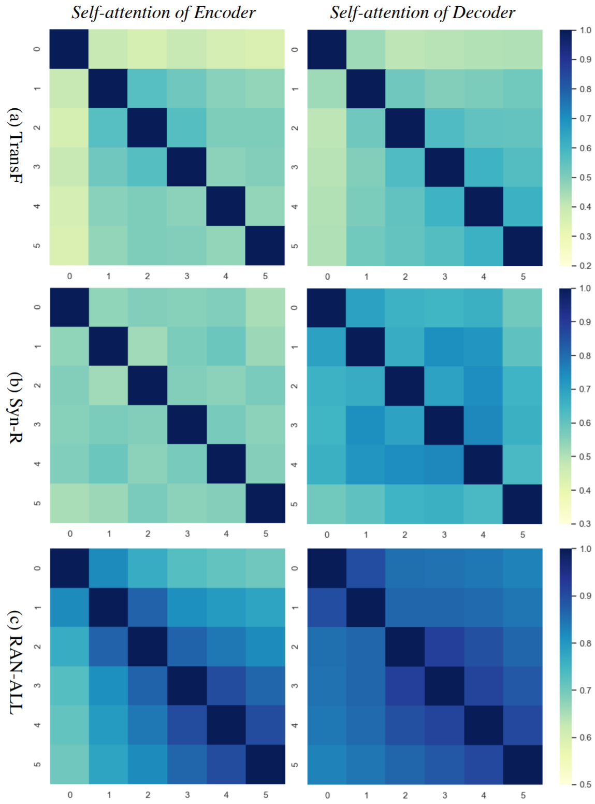

​Upon its emergence, the Transformer Neural Networks [1] dominates the sequence-to-sequence tasks. It even outperforms the Google Neural Machine Translation model in specific tasks. Specifically, the multi-head attention mechanism that depends on element-wise dot-product is deemed as one of the critical building blocks to get things to work. But is it really that important?

<!-- more -->

Reading Time: About 10 minutes.

Paper：<https://aclanthology.org/2021.emnlp-main.258/>

Github: <https://github.com/lemon0830/RAN>

## Introduction
A recent work that appeared at the 2021 Conference of Empirical Methods in Natural Language Processing, dives into analyzing the efficacy of the dot-product self-attention module. As recent research has shown that most attention heads only learn simple positional patterns, this paper steps further towards this line and propose a novel substitute mechanism for self-attention: Recurrent AtteNtion (RAN).

The basic idea of RAN is to directly learn attention weights without any token-to-token interaction and perform layer-to-layer interaction. By performing a massive number of experiments on 10 machine translation tasks, this paper empirically proves that the RAN models are competitive and outperform their Transformer counterparts in certain scenarios, with fewer parameters and inference time. Specifically, applying RAN to the decoder of Transformer yields consistent improvements by about +0.5 BLEU on 6 translation tasks and +1.0 BLEU on Turkish-English translation tasks.

This blog post is organized in the following way: 1) Brief introduction of the Transformer Neural Network, with a focus on the basics of the multi-head self-attention module 2) Problem associated with the self-attention module 3) The solution provided by the RAN mechanism 4) The performance and analysis of RAN.

## Multi-head Attention Module

The figure above gives an overview of the Transformer Architecture. The left-hand side provides the encoder architecture, while the right-hand side gives the decoder architecture. Both of the encoder and decoder are stacked by N sub-layers, and the multi-head attention module is the main component in both the encoder and decoder layer. The encoder encodes the inputs and generates the context vector, which serves as an input to the decoder for decoding the output sequences. We refer the interested readers to the original paper [1] and only focus on the Multi-Head Attention module in this article.

The figure above depicts the computation of the dot-product self-attention of the `k`-th head in the `l`-th encoder layer. Given a sequence of token representations with a length of `n`, the self-attention model first converts the representations into three matrice `Q`, `K` and `V`, representing queries, keys, and values, respectively. And `d_k` is the dimensionality of the vector in the `k`-th head. Then, the attention matrix is calculated via the dot product of queries and keys followed by rescaling:

Finally, a softmax operation is applied on this unnormalized attention matrix, and then the output is used to compute a weighted sum of values:

where `H` is a new contextual representation of the `l`-th layer. This procedure can be implemented with a multi-head mechanism by projecting the input into different subspaces, which requires extra splitting and concatenation operations. The output is fed into a position-wise feed-forward network to get the final representations of this layer.

## Problem Associated with the Self-attention
While flexible, it has been proven that there exists redundant information with pair-wise calculation. Many studies have shown that pairwise self-attention is over-parameterized, leading to a costly inference [2, 3, 4]. The RAN method takes this direction to an extreme by showing that self-attention is empirically replaceable. And next, we will formally introduce the RAN method.

## RAN: Recurrent Attention
RAN consists of a set of global `Initial Attention Matrices` and a `Recurrent Transition Module`. Instead of computing the attention weights on the fly as in the original multi-head attention module in each layer, RAN directly learn the attention weights, denoted as

which are exactly the so-called `Initial Attention Matrices`. Here `h` denotes the number of heads. On the other hand, the `Recurrent Transition Module` takes the set of `A0` as input, and recursively updates the attention matrices layer by layer. Note that the `Initial Attention Matrices`, the `Recurrent Transition Module`, and the other modules are optimized jointly. The attention matrices are completely agnostic to the input representations and can be retrieved directly without recomputation during inference.

Figure above gives the model architecture of the RAN, where the dotted line denotes parameter sharing. It also shows the computation of the `k`-th head in the `l`-th encoder layer. The recurrent transition module obtains the attention weights in `l`-th layer `Rec(∗)` with the attention matrix from the last layer.

Moreover, the `Recurrent Transition Module` is implemented using a single feed-forward network with tanh as its activation function followed by a layer normalization and a residual connection:

Notably, the parameters of the transition module are shared across all heads and all layers.

## Effectiveness and Analysis of the RAN.

### 1. Main results
The original paper evaluates RAN on WMT and NIST translation tasks, including 10 different language pairs altogether. Besides, the authors tried to apply RAN to the encoder (RAN-E), the decoder (RAN-D), or both of them (RAN-ALL), respectively. They compare against the standard Transformer (TransF) [1], and the two most related works are Hard-coded Transformer (HCSA) [5] and Random Synthesizer. (Syn-R) [6].

Table 1 shows the overall results on the ten language pairs. Compared with TransF, the RAN models consistently yield competitive or even better results against TransF on all datasets. Concretely, 0.13/0.16, 0.48/0.44, and 0.16/0.22 more average BLEU/SacreBLEU are achieved by RAN-E, RAND, and RAN-ALL, respectively. Although different languages have different linguistic and syntactic structures, RAN can learn reasonable global attention patterns over the whole training corpus.

Interestingly, RAN-D performs best, which significantly outperforms the TransF on most language pairs. The biggest performance gain comes from the low resource translation task Tr⇒En where RAN-D outperforms TransF by 0.97/1.0 BLEU/SacreBLEU points. We conjecture that the position-based attention without tokenwise interaction is easier to learn and the RAN can capture more generalized attention patterns. By contrast, the dot-product self-attention is forced to learn the semantic relationship between tokens and may fall into sub-optimal local minima, especially when the training scale is low.  In brief, the improvement indicates that NMT systems can benefit from simplified decoders when training data is insufficient. Besides, although both RAN-E and RAN-D are effective, their effects can not be accumulated.

Moreover, we can see that RAN-ALL vastly outperforms the other two related methods. RAN bridges the performance gap between Transformer and the models without the dot-product self-attention, demonstrating the effectiveness of RAN. And from the figure below, we can see that RAN-ALL successfully speeds up the inference phase.

### 2. Analysis
The figure below visualizes the attention patterns of RAN over positions

We find that in the encoder, RAN focuses its attention on a local neighborhood around each position. Specifically, in the last
layer of the encoder, the weights become more concentrated, potentially due to the hidden representations being contextualized. Interestingly, except attending local windows to the current position, the decoder weights are most concentrated in the first token of target sequences. This may demonstrate the mechanism of decoder self-attention that the RAN decoder attends to source-side hidden states based on global source sentence representations aggregated by the start tokens.

The figure above depicts the Jensen-Shannon divergence of attention between each pair of layers. The conclusions are as follows: First, the attention similarity in TransF is not salient, but the attention distribution of adjacent layers is similar to some extent. Second, there are no noticeable patterns found in Syn-R. Third, as for RAN-ALL, the attention similarity is high, especially in the decoder (the JS-divergence ranges from 0.08 to 0.2), and is remarkable between adjacent layers.

## Summary
The RAN architecture is proposed to simplify the Transformer architecture for Neural Machine Translation without costly dot-product self-attention. It takes the `Initial Attention Matrices` as a whole and updates it by a `Recurrent Transition Module recurrently`. Experiments on ten representative translation tasks show the effectiveness of RAN.

## References
[1] Vaswani, Ashish, et al. "Attention is all you need." Advances in neural information processing systems. 2017.

[2] Sanh, Victor, et al. "DistilBERT, a distilled version of BERT: smaller, faster, cheaper and lighter." arXiv preprint arXiv:1910.01108 (2019).

[3] Correia, Gonçalo M., et al. "Adaptively sparse transformers." arXiv preprint arXiv:1909.00015 (2019).

[4] Xiao, Tong, et al. Sharing attention weights for fast transformer. In Proceedings of IJCAI 2019, pages 5292–5298.

[5] You, Weiqiu, et al. Hard-coded gaussian attention for neural machine translation. In Proceedings of ACL 2020, pages 7689–7700.

[6] Tay, Yi, et al. "Synthesizer: Rethinking self-attention for transformer models." International Conference on Machine Learning. PMLR, 2021.
