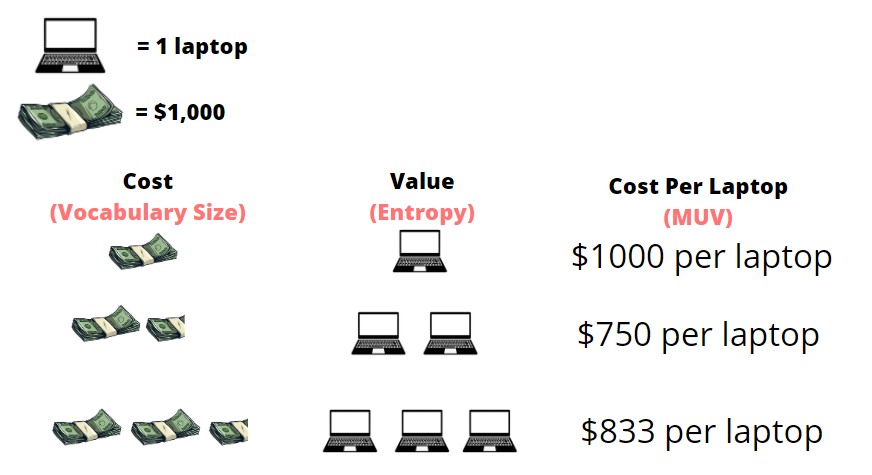
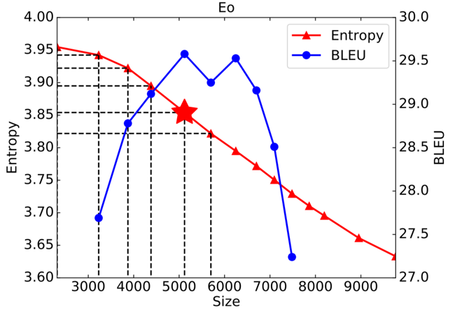
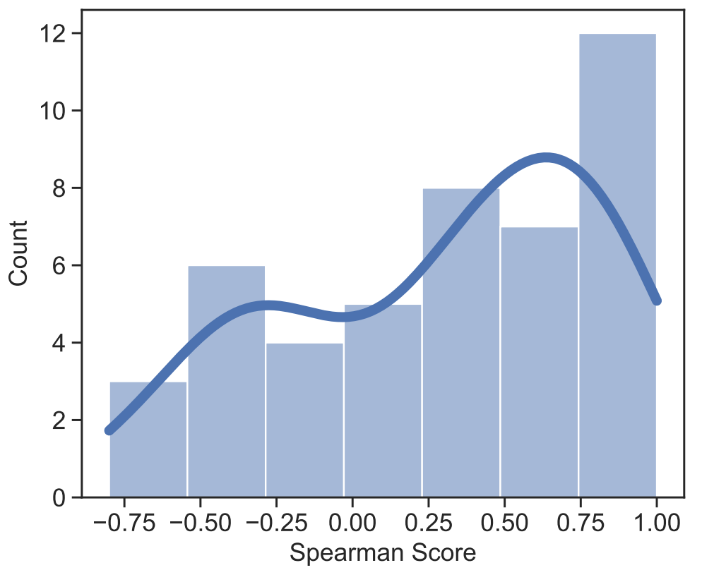
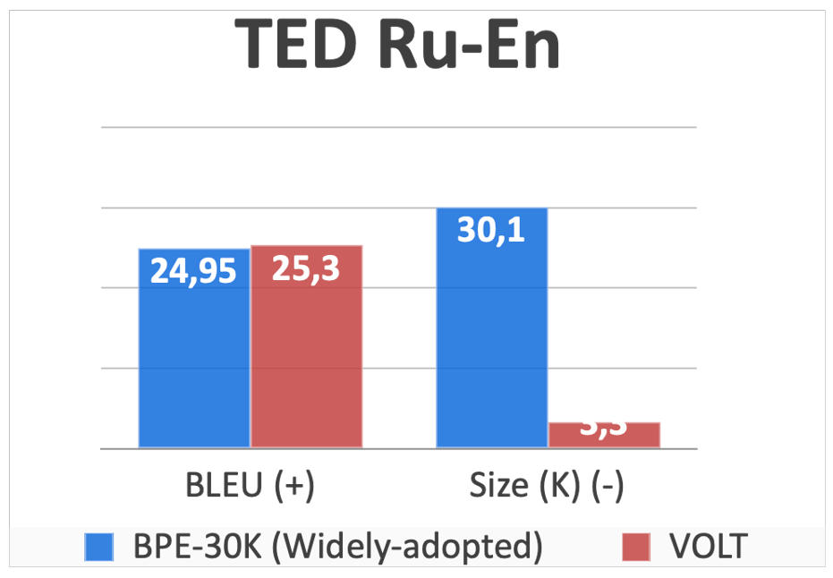
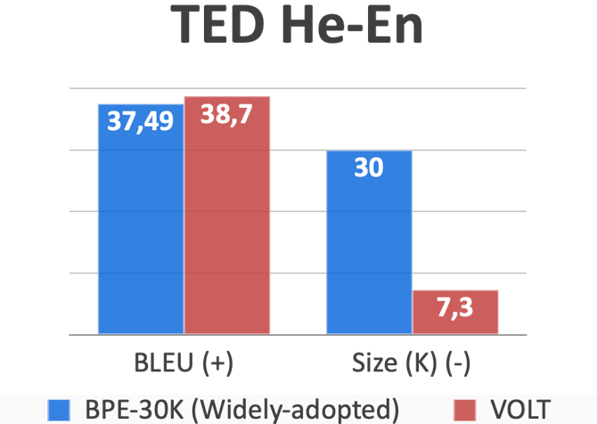
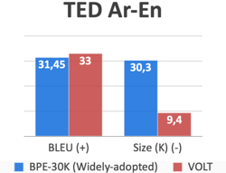
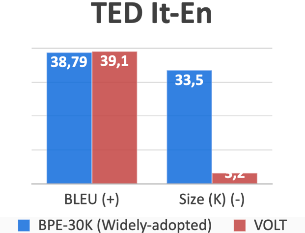

Constructing a vocabulary is a fisrt step for any NLP tasks. 
How can we efficiently learn an optimal vocabulary for machine translation? 
In this blog, I will explain the VOLT algorithm from the paper *Vocabulary Leaning via Optimal Transport for Neural Machine Translation*, which was awarded the best paper at ACL 2021.

Reading time: About 8 minutes

<!-- more -->

Paper: <https://arxiv.org/pdf/2012.15671.pdf>

Code: <https://github.com/Jingjing-NLP/VOLT>

## Introduction

At its core, the paper aims to find a way to reduce resource consumption and computational times of machine translation's vocabulary building algorithms. The method we will explore today could result in machine translation models running much faster on machines with much less computational power than what is required now. A key part of translating between one language and another is taking the text in the original language and breaking it down into tokens to make the translation process much simpler by using the tokens as a foundation of words or characters to use in the translation. Tokens are just key elements of the text, they can be words, characters, or even sub-words. A sub-word is just a part of a word. For instance, a sub-word for both the words "lower" and "lowly" could be "low". The set of tokens that get produced from a piece of text is called a token vocabulary. Here is an example of a sentence and some possible token vocabularies from that sentence. 

Which one of these generated token vocabularies is better? The word level vocabulary has the advantage of the smallest size, but it runs into the following issue. If there is a word or character we cannot construct with our token vocabulary, we denote this as an unknown or out of vocabulary token and label it as [UNK] or [OOV]. Obviously, the goal is to have as few [UNK] tokens as possible. With word vocabularies, there is a higher chance of [UNK] tokens since any word not in our training corpus will not be constructable with our generated vocabulary. On the opposite end of the spectrum, the character level token will have very few [UNK] tokens as we can construct most tokens with characters in our vocabulary. However, the size of the token vocabulary, as can be seen from the example above, is quite large. Sub-word vocabularies are a good mix between word and character level vocabularies as they can construct tokens that would otherwise be [UNK] and have a manageable size compared to character level vocabularies. Even though we now know that sub-word vocabularies are the preferred type, we still do not know what vocabulary we should choose from given all the possible sub-word vocabularies. For instance, going back to the previous example we can have many sub-word vocabularies generated.

These 3 generated vocabularies are all sub-word vocabularies with different sizes and abilities to construct words. Just by looking at it, there is no way to tell which of these vocabularies is the best. Hence, we must construct a systematic way to find which vocabulary is better. This is where VOLT comes in. VOLT aims to find the best possible token vocabulary that can be generated from a piece of text in an efficient manner. VOLT and other vocabulary generation algorithms use the concept of entropy. Entropy just means the amount of information present in each token. If a certain word or character occurs a lot in a piece of text, then each time we add it as a token we add a relatively small amount of information since its already widely present in the text. However, if a word occurs only once then adding it to our vocabulary would be quite valuable as we only add it that one time. Words or character that occur often have a higher entropy than low occurring words or characters. Intuitively, a vocabulary with the lowest possible entropy would be optimal as it holds a lot of information per token. The main objective of VOLT is to find the best vocabulary in terms of both optimizing size and entropy. As we’ll see later, this often results in much smaller vocabulary sizes than vocabularies generated by other algorithms.

VOLT has other advantages other than reducing the vocabulary size. Firstly, VOLT does not only reduce size but produces an overall better vocabulary than current methods. We will see performance metrics later that show this off. Secondly, VOLT works well on multilingual MT settings. This means that VOLT performs better on a more diverse range of languages than other methods such as Byte-Pair Encoding (BPE) [1]. Lastly, VOLT uses less resources and computational time than current prevailing methods. For instance, on English to German translation, VOLT uses 30 GPU hours while conventional methods such as BPE-Search take 384 GPU hours. This is because VOLT does not require trail training when it comes to computing the optimal vocabulary. Trail training just means having to iterate through all possible vocabulary sizes to find the best vocabulary at the best size, this methodology is extremely inefficient and so its use is avoided in VOLT. 

The question to now be asked is why is VOLT necessary. Why do we need to reduce vocabulary size in the first place? In this next section, we will discuss the current issues with other tokenization methods and why VOLT is necessary.

## Issues with current tokenization models

Most current translation models use word-level vocabularies. As discussed above, sub-word vocabularies tend to be overall better. Using a sub-word level encoding can help decrease the sparsity of tokens and increase the shared feature of similar words. My previous example of taking “low” from “lowly” and “lower” previews how we can have these shared features between words. Furthermore, sub-level vocabularies tend to have shorter sentence lengths and no rare words compares to character level vocabularies.

Sub-word vocabularies seem great, but the issue lies with the methods the use them. Here is an example of an analysis on piece of text done by BPE.

BPE works by merging frequent character sequences to make sub-words for the token vocabulary. In the above image. A hyphen is placed in every position there is a possible merge of multiple characters into a sub-word. Nonetheless, our concern here is not how BPE works but the fact that its analysis focuses on how often a character sequence occurs and merges frequent character sequences together. However, BPE does not consider any of the features, namely size, of the resulting vocabulary.   

The question here becomes, if the problem with BPE is size why not just run BPE for all possible sizes and pick the best one. To do this, we would have to run BPE-1K, BPE-2K, BPE-3K, … all the way up to BPE-60K. For each one we would have to train the model on a collection of text and then conduct tests to retrieve BLEU score for each model, which is a performance metric, and then pick the vocabulary with the highest score. It is not difficult to see that this would take extremely long to produce the best vocabulary. Just running BPE on 12 different sizes and getting the best vocabulary takes **384** computing hours on the GPU as we will see later. Therefore, VOLT is needed, it allows us to find a vocabulary without having to iterate through every possible vocabulary size to find the optimal one. In the next section, we will discuss how VOLT manages to achieve this. 

## Techniques of VOLT

To attempt to optimize both entropy and size, we will use the idea of Marginal Utility. In economics, marginal utility is the amount of satisfaction a consumer attains from consuming a unit of a product. It is used to balance between the benefit and the cost. Let’s look at the following example to make things clear. A high school is buying laptops in bulk for its students, it needs to find the optimal amount and price to buy these laptops at. Here are some of its options

While it may seem like an easy choice for the school to just buy 400 laptops. 400 laptops might be too much, meaning laptops would go unused and the school would have wasted money. Hence, the optimal choice would be choosing 200 laptops which would fit the school’s needs at a good price. This is the concept of marginal utility. We apply this same concept in the paper by using vocabulary size as the cost and the value is the information per character, which as defined before is entropy. We define a new concept, the Marginal Utility of Vocabularization (MUV), which finds the best trade-off between size and entropy. For VOLT to find the optimal vocabulary, it needs to find the vocabulary with the highest MUV. 

Intuitively, the equation for MUV is the derivation of entropy with respect to size as we want to know how much we are sacrificing in terms of a larger vocabulary size with every drop in vocabulary entropy. Now that MUV is defined, we can view VOLT as an optimal transport problem. There have been algorithms developed to efficiently solve optimal transport problems such as the Sinkhorn algorithm which is used here to find the vocabulary with the highest MUV, which is the optimal vocabulary.

Our initial goal was to find the vocabulary with the highest BLEU score, this was then simplified to the vocabulary with the highest MUV. With an equation for MUV as defined above, we further reduced this to an optimal transport problem which already has well known solution. Lets take a look at how effective the usage of MUV is.

Initial results show that the usage of MUV has a correlation with two-thirds of tasks performed. Let’s now look at a few figures to clarify the points being made here.

Firstly, it’s helpful to understand that BLEU and Spearman score are just two performance metrics and not knowing the details of how they work does not affect one’s ability to understand these figures. In the first model, we have entropy on the y-axis and size on the x-axis. Notice the roughly inversely proportional relationship between them. The BLEU score is also graphed, and a star is placed at the vocabulary with highest MUV. Notice that the starred vocabulary is the one corresponding to the vocabulary with the highest BLEU score, meaning it is the best performing vocabulary. 

For the second figure, experiments were conducted on 45 language pairs and the spearman score between MUV and BLEU were recorded for each pair. Spearman score here is just a correlation score where the higher the correlation between MUV and performance, the higher the spearman score. The figure shows the results with the spearman score on the x-axis and the number of generated vocabularies that correspond to a certain spearman score range on the y-axis. The results show that for two-thirds of the generated vocabularies there is a positive spearman score indicating a correlation between MUV and performance.

## Effectiveness of VOLT

The experiments shown here are conducted from one of the three following datasets. The WMT-14 English-German dataset which has 4.5 M English-German sentence pairs. The TED bilingual dataset where we chose 12 different language pairs that had the most training data. Lastly, the TED multilingual dataset where we chose 52 language pairs on a many-to English setting. 
Here are some of the main advantages of VOLT:
### 1.	Overall better performance than widely used vocabularies

In a paper by Shuoyang Ding [2], it was found that among the 42 papers accepted for the Conference of Machine Translation(WMT), the most common size was 30K-40K. Hence, we compare VOLT’s BLEU (performance) scores with a popular method such as Byte Pair Encoding with a 30K vocabulary size. Here are the results:

In all of these examples, not only does VOLT produce a vocabulary that is almost 10x smaller than that of BPE-30K, but it also actually outperforms it as well in terms of BLEU score. Out of the 24 some language to English translation, VOLT outperformed BPE-30K on 23 of them. 

### 2. Low Resource Consumption

To explore VOLT’s resource consumption in respect to other methods, we will first run BPE-1K, BPE-2K, BPE-3K, BPE-4K, BPE-5K, BPE-6K, BPE-7K, BPE-8K, BPE-9K, BPE-10K, BPE-20K, and BPE 30K and select the best performing vocabulary out of those produced by these runs. We will cause this method of running several BPE’s and selecting the best one BPE-Search. We will compare BPE-Search with VOLT to get the following results:

In the figure above, GH and CH are GPU Hours and CPU Hours respectively. The results seem to indicate that the performance score of both is extremely similar. However, VOLT seems to be a better option as it produces a vocabulary in 300+ less computing hours than BPE-Search, making it a much more efficient algorithm.

### 3.	Versatile, better on a large array of languages

To test how good VOLT is across as many languages as possible. We conduct experiments to compare VOLT to BPE-60K as that it the most popular size setting for multi-lingual translation tasks. Here are the results:

The figure shows results for BPE-60K and VOLT on 20 different languages to English translation tasks. VOLT performs better than BPE-60K on 18 of those languages which shows how versatile VOLT is.

## Summary

A key part of machine translation is the process of vocabulary building and tokenization. For one language to be translated to another, we must extract all the key elements of the source language text such as words and characters and use those to translate the text to another language. Traditionally, tokenization methods tend to focus on how frequently a word or character pair occurs to decide whether to make it a token. However, these methods do not consider how big the token set is going to end up being, which also affects the performance of the resulting token set on translation tasks. The method introduced in this paper, VOLT, considers both word frequency and size to produce better performing token sets. In addition, VOLT does not iterate through all possible sizes to find the best one; instead, it treats the problem as an optimal transport problem. This means it applies constraints on the possible optimal sizes and utilizes transport matrices to come up with the optimal size. VOLT is an important method when it comes future machine translation models as it could result in faster training times and better performance all in less computing hours.

## References
[1] Sennrich, Haddow, et al. “Neural machine translation of rare words with subword units.” In Proceedings of the 54th Annual Meeting of the Association for Computational Linguistics, ACL 2016, August 7-12, 2016, Berlin, Germany, Volume 1: Long Papers. The Association for Computer Linguistics

[2] Ding, Renduchintala, et al.  “A call for prudent choice of subword merge operations in neural machine translation.” In Proceedings of Machine Translation Summit XVII Volume 1: Research Track, MTSummit 2019, Dublin, Ireland, August 19-23, 2019, pages 204– 213. European Association for Machine Translation.

