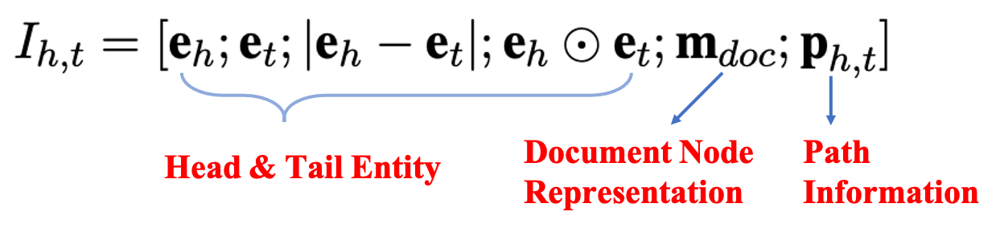
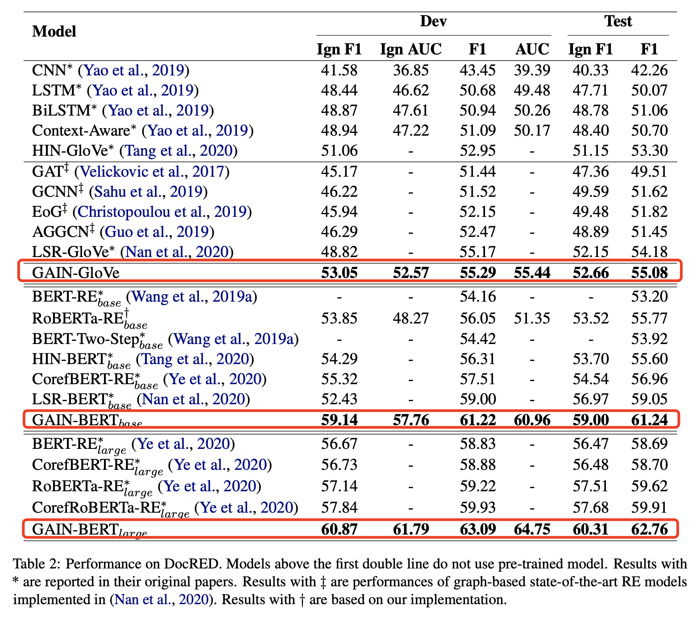
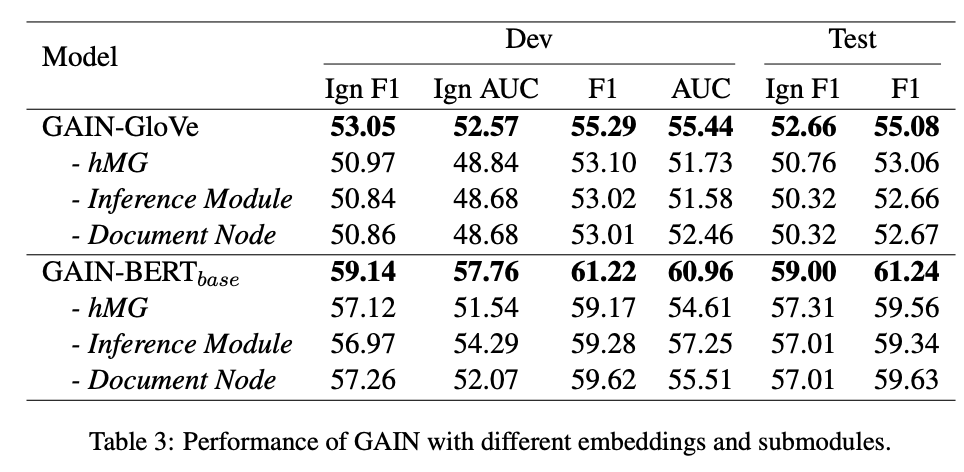
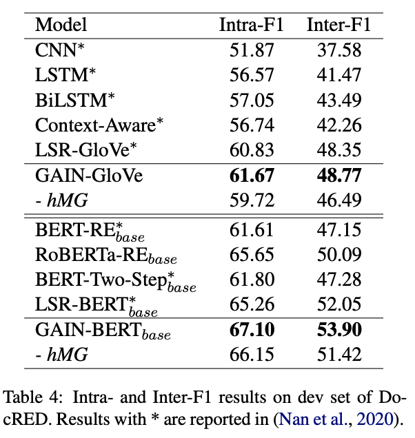

**Double Graph Based Reasoning for Document-level Relation Extraction**

<!-- more -->

## Background

The task of identifying semantic relations between entities from text, namely relation extraction (RE), plays a crucial role in a variety of knowledge-based applications. Previous methods focus on sentence-level RE, which predicts relations among entities in a single sentence. However, sentence-level RE models suffer from an inevitable limitation – they fail to recognize relations between entities across sentences. Hence, **extracting relations at the document-level is necessary** for a holistic understanding of knowledge in text.

## Challenges

There are several major challenges in effective relation extraction at the document-level. The figure below shows an example.

1. The subject and object entities involved in a relation may appear in different sentences, e.g., the relation between **Baltimore** and **U.S.**, as well as **Eldersburg** and **U.S**.
2. The same entity may be mentioned multiple times in different sentences. 
3. The identification of many relations requires techniques of logical reasoning, e.g., **Eldersburg** belongs to **U.S.** because **Eldersburg** is located in **Maryland**, and **Maryland** belongs to **U.S.**.

## Our proposed Model: GAIN

To tackle the challenges, we propose **G**raph **A**ggregation-and-**I**nference **N**etwork (**GAIN**). GAIN consists of double graph, i.e., mention-level graph and entity-level graph. Our intuitions are that: 1) Mention-level graph can model the interactions among mentions across sentences, so that global context can be better captured. 2) Entity-level graph can conduct logical reasoning for certain entity pairs over entities.

Our model contains the following four modules.

**Encoding module**. Tokens of the document is represented as the concatenation of word embedding, entity type embedding, and entity id embedding. Then they are fed into the encoder (e.g., LSTM or BERT) to obtain the contextualized representation.

**Mention-level Graph Aggregation Module**. To model the document-level information and interactions among mentions, a heterogeneous mention-level graph is constructed followed by graph convolution network. The graph has two kinds of nodes: 1) *Mention node*, which refers to one specific entity mention in the document; 2) *Document node*, which aims to model the overall document information and serves as a pivot for interactions among different mentions. Three types of edges are leveraged to connect these nodes:

- *Intra-Entity Edge*: Mentions referring to the same entity are fully connected with intra-entity edges. In this way, the interaction among different mentions of the same entity could be modeled.

- *Inter-Entity Edge*: Two mentions of different entities are connected with an inter-entity edge if they co-occur in a single sentence. In this way, interactions among entities could be modeled by co-occurrences of their mentions.

- *Document Edge*: All mentions are connected to the document node with the document edge. With such connections, the document node can attend to all the mentions and enable interactions between document and mentions. Besides, the distance between two mention nodes is at most two with the document node as a pivot. Therefore long-distance dependency can be better modeled.

**Entity-level Graph Inference Module**. To explicitly capture the logic reasoning chain of entity pairs over all the entities, we constuct an entity-level graph by merging mention nodes referring to the same entity in the mention-level graph into an entity node. Concretely, to model the logical chain between a certain entity pair, we find out all the two-hop paths between them, in which a path is represented as the concatenation of both forward and backward edges. Then we levelrage attention mechanism to aggregate multiple paths into a reasoning-aware path representation.

**Classification Module**. Since a pair of entities may contain multiple relations, we formulate the task as a multi-label classification. Concretely, we first concatenate the entity, document, and path representations. Then we feed it into a MLP and use sigmoid function to predict the score for all possible relations.

## Experiments

### Dataset

We evaluate our model on DocRED (Yao et al., 2019), a large-scale human-annotated dataset for document-level RE constructed from Wikipedia and Wikidata. DocRED has 96 relations types, 132, 275 entities, and 56, 354 relational facts in total. Documents in DocRED contain about 8 sentences on average, and more than 40.7% relation facts can only be extracted from multiple sentences. Moreover, 61.1% relation instances require various inference skills such as logical inference (Yao et al., 2019). we follow the standard split of the dataset, 3, 053 documents for training, 1, 000 for development and 1, 000 for test.

### Main Results

We compare the performance among the following models:

- **CNN**, **LSTM**, **BiLSTM**, **Context-Aware**, **BERT-RE**, **RoBERTa-RE**, **CorefBERT-RE**, **CorefRoBERTa-RE**: Using different encoding mechanisms to simply encode the whole document and extract relations.
- **HIN-Glove**, **HIN-BERT**: Extracting relations through a hierarchical interaction network with either Glove embedding or BERT.
- **GAT**, **GCNN**, **EOG**, **AGGCN**, **LSR-Glove**, **LSR-BERT**: Previous graph-based methods, while our graph construction is totally different from theirs and they conduct logical reasoning only based on GCN.
- **GAIN-Glove**, **GAIN-BERT**: Our proposed model with either Glove embedding or BERT.

The evaluation metrics we use are F1/AUC and Ign-F1/Ign-AUC. The latter means we do not consider the triples (i.e., head-relation-tail) that are already contained in the training set.

The key observations are:
- Among the models not using BERT or BERT variants, GAIN-GloVe consistently outperforms all sequential-based and graph-based strong baselines by 0.9∼12.82 F1 score on the test set. 
- Among the models using BERT or BERT variants, GAIN-BERT base yields a great improvement of F1/Ign F1 on dev and test set by 2.22/6.71 and 2.19/2.03, respectively, in comparison with the strong baseline LSR-BERT base. GAIN-BERT large also improves 2.85/2.63 F1/Ign F1 on test set compared with
previous state-of-the-art method, CorefRoBERTaRElarge.
- GAIN can better utilize powerful BERT representation. LSR-BERT base improves F1 by 3.83 and 4.87 on dev and test set with GloVe embedding replaced with BERTbase while our GAIN-BERT base yields an improvement by 5.93 and 6.16.

### Ablation Study

We conduct ablation study by removing the mention-level graph, entity-level graph inference module, and the document node in the mention-level graph. The F1 scores on test set significantly decrease by 2.02\~2.34/1.61\~1.90 for GAIN-Glove/GAIN-BERT.

### Further Analysis

#### Cross-sentence Relation Extraction

We evaluate GAIN on relations within a single sentence (Intra-F1) and those involving multiple sentences (Inter-F1), respectively. GAIN outperforms other baselines not only in Intra-F1 but also Inter-F1. The removal of Mention-level Graph (hMG) leads to a more considerable decrease in Inter-F1 than Intra-F1, which indicates
our hMG do help interactions among mentions, especially those distributed in different sentences with long-distance dependency.

#### Logical Reasoning for Relation Extraction

We evaluate GAIN on relations requiring logical reasoning (Infer-F1), and the experimental results show GAIN can better handle relational inference. For example, GAIN-BERT base improves 5.11 Infer-F1 compared with RoBERTa-RE base. The inference module also plays an important role in capturing potential inference chains between entities, without which GAIN-BERT base would drop by 1.78 Infer-F1.

### Case Study

The figure above shows the case study of our proposed model GAIN, in comparison with other baselines. As is shown, BiLSTM can only identify two relations within the first sentence. Both BERT-RE base and GAIN-BERT base can successfully predict **Without Me** is part of **The Eminem Show**. But only GAIN-BERT base is able to deduce the performer and publication date of **Without Me** are the same as those of **The Eminem Show**, namely **Eminem** and **May 26, 2002**, where it requires logical inference across sentences.

## Conclusion

Extracting inter-sentence relations and conducting relational reasoning are challenging in document-level relation extraction. In this paper, we introduce Graph Aggregationand-Inference Network (GAIN) to better cope with document-level relation extraction, which features double graphs in different granularity. GAIN
utilizes a heterogeneous Mention-level Graph to model the interaction among different mentions across the document and capture document-aware features. It also uses an Entity-level Graph with a proposed path reasoning mechanism to infer relations more explicitly. Experimental results on the large-scale human annotated dataset, DocRED, show GAIN outperforms previous methods, especially in inter-sentence and inferential relations scenarios. The ablation study also confirms the effectiveness of different modules in our model.

## Reference 

- Yuan Yao, Deming Ye, Peng Li, Xu Han, Yankai Lin, Zhenghao Liu, Zhiyuan Liu, Lixin Huang, Jie Zhou, Maosong Sun. 2019. DocRED: A Large-Scale Document-Level Relation Extraction Dataset. In Proceedings of ACL. 
