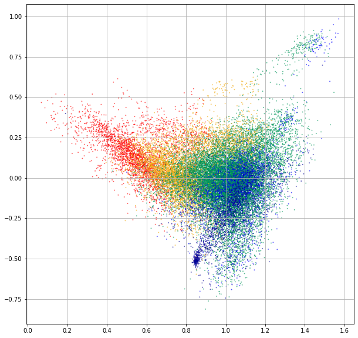
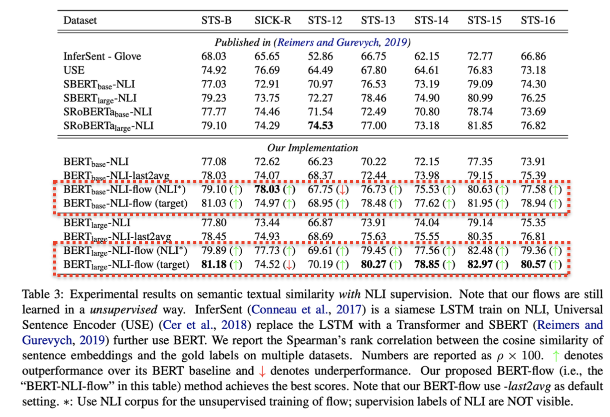

**On the Sentence Embeddings from Pre-trained Language Models**

<!-- more -->

## Background

Recently, pre-trained language models and its variants like BERT have been widely used as representations of natural language. 

Photo credit to https://towardsml.com/2019/09/17/bert-explained-a-complete-guide-with-theory-and-tutorial/

Despite their great success on many NLP tasks through fine-tuning, the sentence embeddings from BERT without finetuning are significantly inferior in terms of semantic textual similarity (Reimers and Gurevych, 2019) – for example, they even underperform the GloVe embeddings which are not contextualized and trained with a much simpler model. Such issues hinder applying BERT sentence embeddings directly to many real-world scenarios where collecting labeled data is highlycosting or even intractable.

## Major Questions

In this paper, we aim to answer two major questions: 

- (1) why do the BERT-induced sentence embeddings perform poorly to retrieve semantically similar sentences? Do they carry too little semantic information, or just because the semantic meanings in these embeddings are not exploited properly? 

- (2) If the BERT embeddings capture enough semantic information that is hard to be directly utilized, how can we make it easier without external supervision?

## Our Findings

We argue that the semantic information in the BERT embeddings is not fully exploited. We first reveal the theoretical connection between the masked language model pre-training objective and the semantic similarity task theoretically, and then analyze the BERT sentence embeddings empirically. We find that BERT always induces a non-smooth anisotropic semantic space of sentences, which harms its performance of semantic similarity. 

### The Anisotropic Embedding Space of BERT

Gao et al. (2019) and Wang et al. (2020) have pointed out that, for language modeling, the maximum likelihood training with Equation 1 usually produces an anisotropic word embedding space. “Anisotropic” means word embeddings occupy a narrow cone in the vector space. This phenomenon is also observed in the pretrained Transformers like BERT, GPT-2, etc (Ethayarajh, 2019).

::: tip 
The BERT word embedding space. The 2D-scatterplot is achieved via SVD-based dimension reduction. The embeddings are colored according to their associated word frequency.
:::

### Word Frequency Biases the Embedding Space

However, as discussed by Gao et al. (2019), anisotropy is highly relevant to the imbalance of word frequency. We observe that high-frequency words are all close to the origin, while low-frequency words are far away from the origin.

This phenomenon can be explained through the softmax formulation of (masked) language models. Note that there is a word-frequency term in the decomposition of the dot product between context and word embeddings. Nevertheless, the PMI term is still highly associated with semantic similarity.

    
    

::: warning Remark
We expect the embedding induced similarity to be consistent to semantic similarity.  If embeddings are distributed in different regions according to frequency statistics, the induced similarity is not useful any more.
:::  

### Low-Frequency Words Disperse Sparsely

We also observe that, in the learned anisotropic embedding space, high-frequency words concentrates densely to their k-nearest neighbors and low-frequency words disperse sparsely.

::: warning Remark
Due to the sparsity, many “holes” could be formed around the low-frequency words in the embedding space, where the semantic meaning can be poorly defined.
:::  

## Proposed Method: BERT-flow

To address these issues, we propose to transform the anisotropic sentence embedding distribution to a smooth and isotropic Gaussian distribution through normalizing flows that are learned with an unsupervised objective. 

A standard Gaussian latent space may have favorable properties which can help with our problem. 

- First, standard Gaussian satisfies isotropy.  By fitting a mapping to an isotropic distribution, the singular spectrum of the embedding space can be flattened. In this way, the word frequency-related singular directions, which are the dominating ones, can be suppressed. 
- Second, the probabilistic density of Gaussian is well defined over the entire real space. This means there are no “hole” areas, which are poorly defined in terms of probability. The helpfulness of Gaussian prior for mitigating the “hole” problem has been widely observed in existing literature of deep latent variable models (e.g., variational auto-encoders).

## Experiments

Experimental results show that our proposed BERT-flow method obtains significant performance gains over the state-of-the-art sentence embeddings on a variety of semantic textual similarity tasks.

### Results w/o NLI Supervision

We perform extensive experiments on 7 standard semantic textual similarity benchmarks without using any downstream supervision. Our empirical results demonstrate that the flow transformation is able to consistently improve BERT by up to 12.70 points with an average of 8.16 points in terms of Spearman correlation between cosine embedding similarity and human annotated similarity.

### Results w/ NLI Supervision

When combined with external supervision from NLI tasks, our method outperforms the **sentence-BERT** embeddings (Reimers and Gurevych, 2019), leading to new state-of-theart performance. 

## Conclusion

We investigate the deficiency of the BERT sentence embeddings on semantic textual similarity. We propose a flow-based calibration which can effectively improve the performance. BERT-flow obtains significant performance gains over the SoTA sentence embeddings on a variety of semantic textual similarity tasks.

## Reference 

- Nils Reimers and Iryna Gurevych. 2019. SentenceBERT: Sentence embeddings using siamese BERT networks. In Proceedings of EMNLP-IJCNLP.
- Jun Gao, Di He, Xu Tan, Tao Qin, Liwei Wang, and TieYan Liu. 2019. Representation degeneration problem in training natural language generation models. In Proceedings of ICLR.
- Lingxiao Wang, Jing Huang, Kevin Huang, Ziniu Hu, Guangtao Wang, and Quanquan Gu. 2020. Improving neural language generation with spectrum control. In Proceedings of ICLR.
- Kawin Ethayarajh. 2019. How contextual are contextualized word representations? comparing the geometry of bert, elmo, and gpt-2 embeddings. In Proceedings of EMNLP-IJCNLP.
