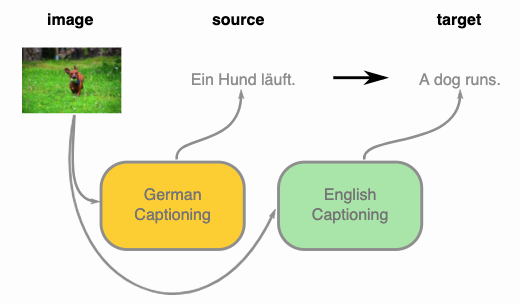
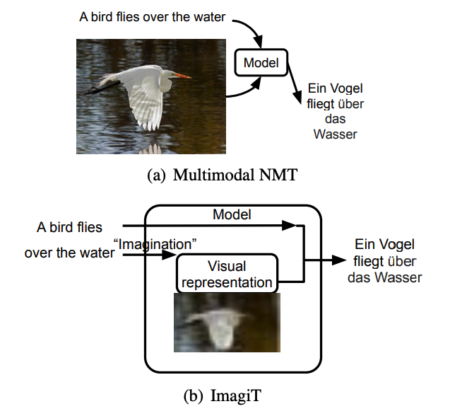

Machine translation has helped people daily life, and is also an important research topic especially in computer science community.
It expands from one language translate to another language, speech translate to text, etc.
Today, I'm going to talk about a paper "Generative Imagination Elevates Machine Translation". I'll cover the background, challenge and motivation behind this paper. Then I'll go through some technical details of this paper as well as some in-depth analysis of their experimental settings and results. Finally, we will discuss about the potential extension of this work. Hopefully, this would give you a better understanding of this area, and point out to a promising research direction.

<!-- more -->

Below is an example of multimodal machine translation, which is try to caption the image in two language and use them as paired translation.
 
Everything sounds like a very straightforward application of ideas that are around for quite a while, but it has a secrete ingredient that makes it work efficiently. It is the way they represent the image that they call “Visual-Semantic Embedding”. They run an object detector for the images and represent each object by the penultimate layer of the object detection network. Then, they learn a projection of the object representations such that hidden states of the text encoder can be expressed as a linear combination of the projected object representations.
Compared to the standard unsupervised translation that relies on iterative back-translation, this way of training improves the translation quality quite a lot. On the other hand, the standard unsupervised methods are designed to work with much larger datasets and these data come from a quite narrow domain. When they integrate this training machinery into a supervised learning setup in addition to standard training examples, they reach the state-of-the-art results.

## 1. Background
Multimodal translation has benn explored for a while after the successful deep learning applcation for both natural language processing and computer vision.
As you can see in below images from the paper, is the problem setup of their proposed **ImagiT**. It is different from existing multimodal NMT, as they only takes sentence in the source language as the usual NMT task. They are trying to generating an image and utilize the internal visual information to help machine translation task.

### 1.1 Challenge
Current state-of-the-art methods are built upon solely textual information, which is not consistent with how human try to implement the tasks. Most of the time, human would leverage some understanding or memory from visual information to help translation process.
How to leverage such visual information to improve NMT task might help it bridge the gap with human performance in multiple domains of machine translation.
But this is a really challenging task, given that the paired images of texts are scarce and synthesized images from textural input are of low quality.

### 1.2 Motivation
Existing multi modal NMT need the paired image as the input, which limit its development, since such bilingual parallel corpora annotated by images are not always available.
And the cost of manual annotation is pretty high.
This paper try to avoid the need of paired image by synthesizing it, thus address the bottlenecks mentioned above.
## 2. Methodology
**ImagiT** is composed of roughly three key components, including imagination, visual representation module and common natural language translation model.
The imagination are usually generated by some GAN techniques, and the visual representation are either extracted from the hidden states of GAN or by extracting features with computer vision SOTA backbones over the generated images.
Then the visual and textual informatoin are fused together for the next step natural language translation task.
### 2.1 Problem Definition
The problem here is given a source language, we want to translate it into a target language in textual modal. In the meantime, instead of gathering paired images, we synthesize the imagination from textual input. Then the imagination is leveraged as the external knowledge, which contains some spatial correspondence to help further NMT task.
### 2.2 Overview
ImagiT embodies the encoder-decoder structure for end-to-end machine translation. Between the encoder and the decoder, there is an imagination step to generate semanticequivalent visual representation. Technically, the model is composed of following modules: source text encoder, generative imagination network, image captioning, multimodal aggregation and decoder for translation.

### Components
For source text encoder, they utilize the state-of-art Transformer-based machine translation framework.
For generativ imagination network, they follow previous common practice of using the conditioning augmentation to enhance robustness to small perturbations along the conditioning text manifold and improve the diversity of generated samples with Generative Adversarial Network.
For an imagined image, its semantic meaning is equivalent to the source sentence. They leverage the image captioning to translate the imagined visual representation back to the source language. Such symmetric structure can make the imagined visual feature act like a mirror, which effectively enhancing the semantic consistency of the imagined visual feature and precisely reflect the underlying semantics.
Then comes to the aggregation part, to finally get the imagined visual textual representation, we have to fuse the representation from both modalities.
By inducing the hidden representation under the guide of image-aware attention and graph persepctive of Transformer would ben elegant method to integrate visual feature.
To train the whole network end-to-end, they leverage adversarial training to alternatively train the generator and the discriminator.
## 3. Experiments
### 3.1 Datasets
They evaluate the proposed ImagiT model on two datasets, Multi30K and Ambiguous COCO. To show its ability to train with external out-of-domain datasets, they adopt MS COCO in the next analyzing section.
And the baseline is the conventional text-only Transformer.
### 3.2 Configuration
For the imagination network, the noise vector’s dimension is 100, and the generated visual feature is 128 × 128. The upsampling and residual block in visual feature transformers consist of 3×3 stride 1 convolution, batch normalization, and ReLU activation. For detailed experimental settings, please refer to the paper.
### 3.1 Results

As can be seen from above table, the main result from the Test2016, Test2017 for the En⇒De and En⇒Fr MNMT task is reported. The first category (Multimodal Neural Machine Translation Systems) collects the existing MNMT systems, which take both source sentences and paired images as input. The second category illustrates the systems that do not require images as input. Since our method falls into the second group, the baselines are the text-only Transformer and the aforementioned works.

## 4. Conclusion and Discussin
Generally, this paper proposed a novel method to generate semantic-consistent visual representations for imagination-guided translation without any anootated images.
But **ImagiT** is not applicable to larger-scale text-only NMT tasks, such as WMT'14, as they are not easy to be visualized, containing fewer objects and visually depictable entities. Besides, it largely depends on the quantity and quality of annotated images.
Future work might be combining with knowledge based imagination for more complex and abstract textual information.

## Reference
- Quanyu Long, Mingxuan Wang, Lei Li. Generative Imagination Elevates Machine Translation. NAACL 2021. <https://arxiv.org/abs/2009.09654>

