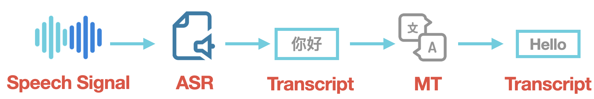
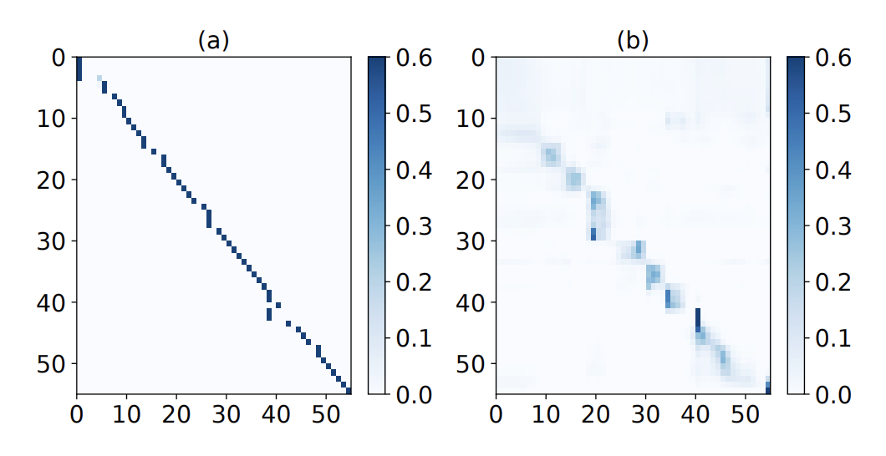

Speech translation (ST) has increasing demand in our daily life and work. Applications like travel assistant, simultaneous conference translation and movie subtitling can highly reduce translation costs. Building a ST system that can understand and directly translate acoustic speech signals into text in a target language is challenging. For example, people do not always premeditate what they are going to say. Not like text translation, ST lacks completed organization sometimes. Another part is that the parallel corpus for ST is not enough, compared to the MT task. Especially, most ST methods are limited by the amount of parallel corpus.

<!-- more -->

Such demanded applications stir interest within the research community. Over its decades history, speech translation has experienced several shifts in its primary research themes. The traditional way is coupled cascades of speech recognition and machine translation. Then, researchers emerged the exploration of tight coupling. Recently, end-to-end models have attracted much attention. To achieve end-to-end speech translation, our research community has made a lot of efforts. Today, we are going to introduce an interesting paper that helps us to break the limitations of the amount of parallel corpus. 

## End-to-end ST

Generally, we use Cascaded ST systems to achieve ST, which extracts acoustic features and source-text semantic features before translating them to the target text. 

Figure 1: The process of Cascaded ST systems

However, such intermediate stages meet challenges in real cases: no sufficient supervision to guide the encoder-decoder to process the audio properly, and the amount of parallel ST training corpus is small. It may generate errors when processing the audio inputs, and then influence the quality of MT.

Therefore, end-to-end ST has been proposed to solve these issues. Methods like pre-training and multi-task learning can significantly improve performance. However, the performance of end-to-end ST is not as good as Cascaded ST for a very long time, since the ST data is insufficient to build a high-quality model.

How to utilize the best of existing ST data to improve the end-to-end ST performance? *Listen, Understand and Translate (LUT): Triple Supervision Decouples End-to-end Speech-to-text Translation* introduces a human-inspired method to complete ST tasks via understanding acoustic information at the semantic level as much as possible, just like humans. It can guide the acoustic encoder to extract information from the auditory input. Additionally, it utilizes a pre-trained BERT model to enforce the upper encoder to produce as much semantic information as possible, without extra data.

## Inspired by Human — LUT

Let's take a look at the human's translation process. For example, when we want to translate Chinese audio to English, we need to listen to the audio first and try to understand the meaning of audio. After processing it in our brain, we can get the outputs. 

Figure 2: The process of how humans translate.

Currently, end-to-end models are built with an encoder-decoder architecture that can directly translate speech without using explicitly generated intermediate ASR output.  Methods like multi-task training and pre-training are used to incorporate additional ASR and MT data and reduce dependency on scarce end-to-end data. However, these techniques were not able to exploit ASR and MT data as effectively as Cascade methods, to get comparable translation quality. 

What if we make the machine to imitate human behaviour in translation? Can we improve the quality of speech translation? The answer is yes. The significant part of LUT is it adds the "understand" function in ST. 

LUT uses an **acoustic encoder** to "Listen", a **semantic encoder** to "Understand", and a **translation decoder** to "Translate", to imitate the intermediate steps for effective end-to-end speech translation. 

Figure 3: The architecture of LUT. 

Specifically, LUT consists of three modules: 

- **Acoustic encoder** network that encodes the audio input sequence into hidden features corresponding to the source text;
- **Semantic encoder** network that extracts hidden semantic representation for translation, which behaves like a normal machine translation encoder;
- **Translation decoder** network that outputs sentence tokens in the target language.

The most interesting feature of LUT is utilizing Connectionist Temporal Classification (CTC) + distance Loss to optimize the encoders, and break the limitation of insufficient parallel ST data within BERT. This is particularly interesting because it is hard to train an end-to-end ST model well with a small number of data (compared to MT). This strategy helps LUT to learn semantic features, meanwhile, it can predict recognition results while predicting translation results. Thus, we can diagnose whether the wrong prediction for translation is caused by the wrong acoustic modelling.

## **Evaluation of the LUT**

To test the effectiveness of LUT, the paper includes Augmented Librispeech English-French, IWSLT2018 English-German, and TED English-Chinese test.LUT achieves all the best performance. Compared to the Cascaded model, LUT is lighter (fewer parameters), which can perform a faster translation. 

### Semantic Analysis

LUT compares the acoustic encoder and semantic encoder in this paper. Figure 3 shows the attention for different module layers. It is interesting that the acoustic encoder focuses on the local features, while the semantic encoder can capture more global features. 

Figure 4: The visualization of attention for different module layers. (a), (b) visualize the attention of the last layer of the acoustic encoder and the first layer of semantic encoder respectively. 

It also compares the acoustic encoder and semantic encoder on the Fluent Speech Commands dataset, to test SpeakerVer (identify the speaker) and IntentIde (intention recognition). In Table 1, the semantic encoder only gets 46.3 accuracy on the SpeakerVer task, showing that the semantic encoder can focus on the translation task. 

|  | SpeakerVer | IntentIde |
| --- | --- | --- |
| Acoustic Encoder | 97.6 | 91.0 |
| Semantic Encoder | 46.3 | 93.1 |

Table 1: Classification accuracy on speaker verification and intent identification.

It finds acoustic information is modelled at low-level layers and semantic information is captured at high-level layers.

### LUT vs Cascaded Model

| Transcription | LUT |
| --- | --- |
| reference | it was mister jack maldon |
| hypothesis | it was mister jack mal |
| Translation |  |
| reference | c'était m. jack maldon |
| hypothesis | c'était m. jack maldon |

| Transcription | Cascaded |
| --- | --- |
| reference | it was mister jack maldon |
| hypothesis | it was mister jack mal |
| Translation |  |
| reference | c'était m. jack maldon |
| hypothesis | c'était m. jack mal |

Here is an example of transcription and translation on En-Fr test set generated by the LUT and Cascaded model. It has a recognition error in the transcription stage (mal). LUT can translate correctly, ignoring the mistake that happened in transcription, while Cascaded Model can not correct the error and continue to pass the incorrect signal.

LUT not only can directly translate to the target language within the original audio information, but also is fault-tolerant during the acoustic modelling.

# Summary

LUT is a unified training framework to decouple the end-to-end speech translation
task, under the supervision of the acoustic, semantic, linguistic level. It is effective and utilizes existing data to solve the problem of insufficient ST data. 

The code can be found at:  [https://github.com/dqqcasia/st](https://github.com/dqqcasia/st)

[GitHub - dqqcasia/st: End-to-end Speech Translation](https://github.com/dqqcasia/st)

Paper: [https://arxiv.org/pdf/2009.09704.pdf](https://arxiv.org/pdf/2009.09704.pdf)

# Reference

1. Dong Q, Ye R, Wang M, et al. " Listen, Understand and Translate": Triple Supervision Decouples End-to-end Speech-to-text Translation[J]. AAAI 2021.

2. Sperber M, Paulik M. Speech Translation and the End-to-End Promise: Taking Stock of Where We Are[C]//Proceedings of the 58th Annual Meeting of the Association for Computational Linguistics. 2020: 7409-7421.

3. Stoian M C, Bansal S, Goldwater S. Analyzing ASR pretraining for low-resource speech-to-text translation[C]//ICASSP 2020-2020 IEEE International Conference on Acoustics, Speech and Signal Processing (ICASSP). IEEE, 2020: 7909-7913

4. Weiss R J, Chorowski J, Jaitly N, et al. Sequence-to-sequence models can directly translate foreign speech[J]. arXiv preprint arXiv:1703.08581, 2017.

# Supplemental Materials

1. Baevski A, Zhou H, Mohamed A, et al. wav2vec 2.0: A framework for self-supervised learning of speech representations[J]. arXiv preprint arXiv:2006.11477, 2020.

2. Han C, Wang M, Ji H, et al. Learning Shared Semantic Space for Speech-to-Text Translation[J]. arXiv preprint arXiv:2105.03095, 2021.

3. Vaswani A, Shazeer N, Parmar N, et al. Attention is all you need[C]//Advances in neural information processing systems. 2017: 5998-6008.