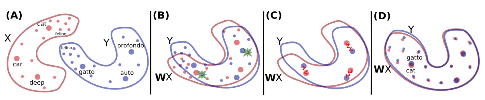
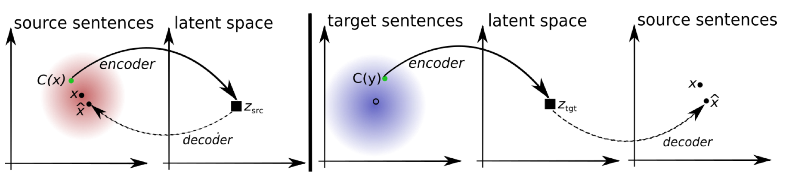
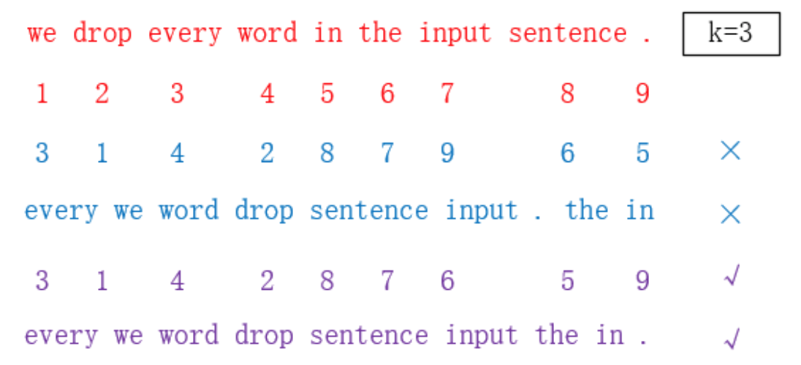
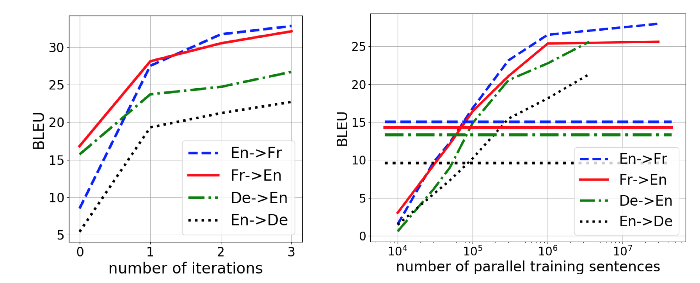
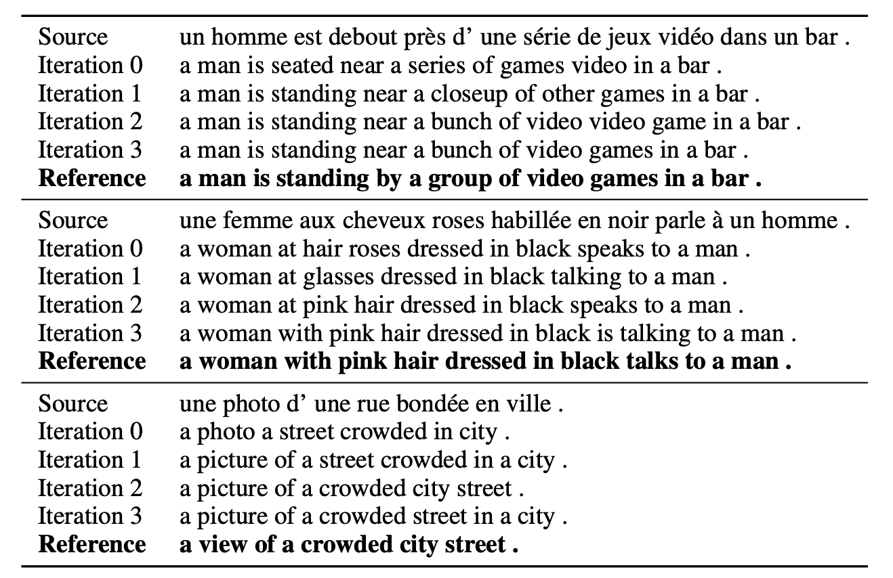

Can one build a neural machine translation model without parallel data?

<!-- more -->

Recently, the neural machine translation model has developed greatly thanks to the transformer-based encoder-decoder translation model and the corresponding parallel corpus. The parallel corpus refers to the parallel sentence/paragraph pairs that have the same meanings, but one in the source language and the other in the target language. During training, the model will encode the source language sentences, and decode autoregressively to generate the sentences in the target language fields, and the losses are calculated based on the similarity between the generated sentences and the corresponding ground truth target sentences. Therefore, the performance of transformer-based encoder-decoder model highly depends on the quality and quantity of the parallel corpus.

While there are many parallel corpus resources for commonly used languages, there are also many **low-resource** languages that fail to present enough parallel corpus for training, and some of them have much more monolingual resources, without translations. Is it possible to utilize those monolingual resources to do machine translations?

This might look crazy - imagine that when someone learns a new language but he/she is not told the translations for a sentence. It is indeed not be able to be achieved by a traditional neural machine translation model. However, with the help of unsupervised learning, it is possible to use only monolingual corpus to achieve a fair performance on many machine translation tasks. The method is proposed by G. Lample et al. in 2017 in the Facebook AI Research Group and the Sorbonne University. Let's take a further look at how this work bridges the gap between two unpaired languages.

### Motivations and Overview
As previously discussed, the proposed method is unsupervised. The key problem here is how to self-align the same meanings from different languages. Specifically, in the embedding spaces of two different languages, the words and sentences that have similar meanings should be mapped to each other. To see this clearly, let's first visually take a look at the word-level map, which is proposed by the same research group in the paper "Word Translation Without Parallel Data"[2].

As suggested in the image, to map embedding of two different languages in the word level, it is possible to learn a matrix $$W$$ that transforms the embedding of the words in one language to words in the other language. The key idea here is, to map the languages is equivalent to mapping the embedding space of the languages.

In this work, the map is also done by learning to properly map the embedding space. However, different from their word-level work, they no longer map one language to the other one directly. Instead, they achieve the map by learning a shared latent space. This is a more natural way in sentence-level translation, since in an encoder-decoder MT model, the encoder exactly transforms the sentences from the source space to a latent space. If the latent spaces of two different languages are actually shared, the alignment is done without a need for supervised inputs, or parallel sentence pairs.

### Methods
The proposed method is demonstrated in the figure below. 

To learn a shared latent space, the translation model needs to encode different languages into the same embedding space, and similarly, decodes from the shared space. Therefore, this work also learns aggregate encoder and decoder as $$e(x,l)$$ and $$d(x,l)$$, where $$x$$ is the embedding and $$l$$ denotes the language.

With this new encoder-decoder structure, the remaining task is to correctly learn the encoder and decoder so that a shared embedding space can be obtained. Therefore, this work proposes 3 training objectives:

- Reconstruction loss
- Cross-domain loss
- Generative and discriminative loss

#### Reconstruction loss
The word "reconstruction" refers to recovering the encoded sentences to the original ones, which is demonstrated in the previous left sub-figure. Namely, the encoder will encode the sentences from source or target space to latent space, and the decoder should be able to restore the exact sentences from the latent space. 

In practice, we perturb the input sentence using a function $$C(\cdot)$$ so that the encoder learns in a slightly noisy distribution. To add noise to the original input, this work applies 2 methods: First, they randomly drop some of the words in the sentences with probability $$p_{wd}$$. Second, they slightly re-permute the words with the restriction that the words' order does not change too much from the original ones. Specifically, the parameter $$k$$ controls the maximum allowed order changed from the original ones. The following figure (cited from [4]) demonstrates how the $$k$$ restricts the re-permutation.

The reconstruciotn loss is given by
$$L_{auto}(\theta_{enc}, \theta_{dnc}, Z, \ell) = \mathbb{E}_{x\sim D_l, \hat{x}\sim d(e(C(x),l),l)}[\Delta(\hat{x}, x)],$$
where $$\theta_{enc}$$ and $$\theta_{dnc}$$ denote the parameters for the encoder and decoder, and $$x$$ and $$\hat{x}$$ are the original sentences and reconstructed sentences. This loss measures the difference between reconstructed sentences and original ones with small perturbations, and it reflects the ability of encoder and decoder to transform between sentence embedding spaces and latent spaces. $$Z$$ is the words embedding that are unchanged during the encoder and decoder learning.

#### Cross-domain loss
The motivation of the cross-domain loss is demonstrated in the previous right sub-figure. In machine translation, the model translates a sentence from one language to another one. The cross-domain loss effectively measures the performance of the translation. Specifically, after we obtain the translated sentence, the cross-domain loss measures if the encoder and decoder is able to back-translate[3] the sentence in the target language domain.

Formally, the cross domain loss is
$$L_{cd}(\theta_{enc}, \theta_{dnc}, Z, \ell_1, \ell_2) = \mathbb{E}_{x\sim D_{l1}, \hat{x}\sim d(e(C(M(x)), \ell_2), \ell_1)}[\Delta(\hat{x}, x)],$$
where $$M(x)$$ means applying the current translation model to sentence $$x$$ and obtain sentence $$M(x)$$ in the target language domain. Similar to previous setting, the sentence $$M(x)$$ is also perturbed with random noise by function $$C$$. The cross domain loss finally measures the difference between the original sentences and the back-translated sentences.

#### Generative and discriminative loss
The adversarial training is introduced to ensure embedding of two languages map to the same latent space. Specifically, the discriminator distinguishes the latent vectors from 2 different languages and tries to specify which language does the given latent vector come from, while the generator, which is our encoder in this case, should generate similar latent vectors to fool the discriminator. The generative and discriminative loss is
$$L_{adv}(\theta_{enc}, Z|\theta_{D}) = -\mathbb{E}_{(x_i, \ell_i)}[\log p_D(l_j|e(x_i, \ell_i))].$$
The loss is minimized when the discriminator does not know which language it comes from. Mathematically, it corresponds to the case when the probability of classifying a sentence to correct language is minimized.

Finally, the objective function is the combination of the 3 losses above. The whole procedure can be summarized in the figure below.

### Experiments and Case study
Although the paper says the code will be released upon acceptance, to my best knowledge, the code is not publicly available now. A search on Github does not give related code, and paperwithcode points on the following website [https://github.com/facebookresearch/MUSE], which is a different work in Facebook AI Research. Therefore, the following discussion is based on the reported numbers and figures in the original paper.

This unsupervised method works pretty well. Let's first take a look at their BLEU scores on Multi30k-Task1 and WMT datasets.

From their results, we can observe that the proposed unsupervised learning method on MT significantly outperforms the previous method, such as the trivial word-by-word method. Although there is a 10~25 score gap between the supervised MT method and the proposed method, it is surprisingly enough to observe that the proposed method has achieved very good translation without using any parallel corpus.

Also, the following experiments further shows the effectiveness of this proposed methods. The left subfigure shows how the model learns with the iterations increase, demonstrating that the total objective functions successfully boost the performance of the encoders and decoders in the translation model. The right subfigure shows that this proposed method is comparable to the supervised method with 100,000 parallel sentences pairs. This demonstrates that the unsupervised method in this work can be very useful for the low-resources languages with lower amount of parallel sentences available. 

Finally, let's take a case study and check how the performance of translations improved at each iteration. From the following experiments, we can observe that at the first iteration, the model is already able to translate the source sentences to the target field, while their meanings are stil in fragments. However, after 3 iterations, the translations become pretty good and convey most, if not all, of the original meanings.

### Conclusion
In this work, the authors propose a novel unsupervised way to do machine translations by learning a shared latent space between the source and target languages. This method shows surprisingly good performance on different MT tasks, and is comparable to or outperforms the supervised methods with few parallel sentence pairs. Therefore, this proposed unsupervised method is very useful in low-resource language machine translations.

#### Reference
[1] Lample, Guillaume, et al. "Unsupervised machine translation using monolingual corpora only." arXiv preprint arXiv:1711.00043 (2017).
[2] Conneau, Alexis, et al. "Word translation without parallel data." arXiv preprint arXiv:1710.04087 (2017).
[3] Brislin, Richard W. "Back-translation for cross-cultural research." Journal of cross-cultural psychology 1.3 (1970): 185-216.
[4] https://zhuanlan.zhihu.com/p/31404350

