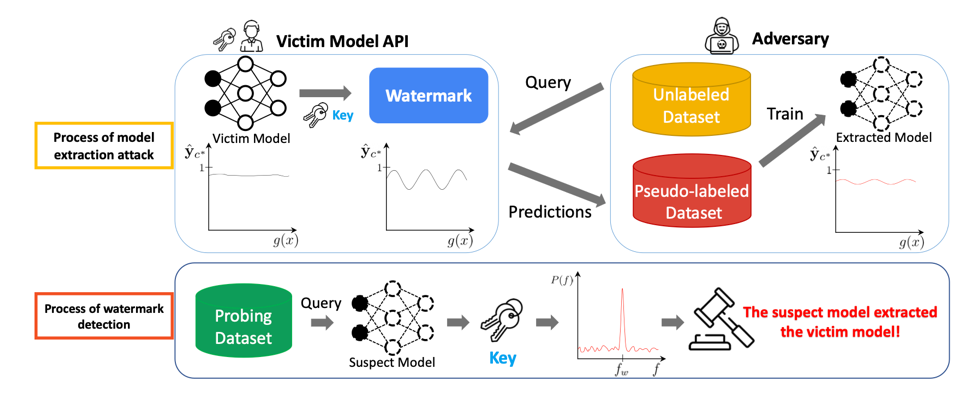
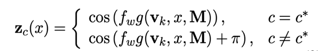
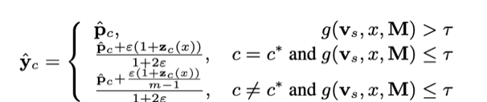
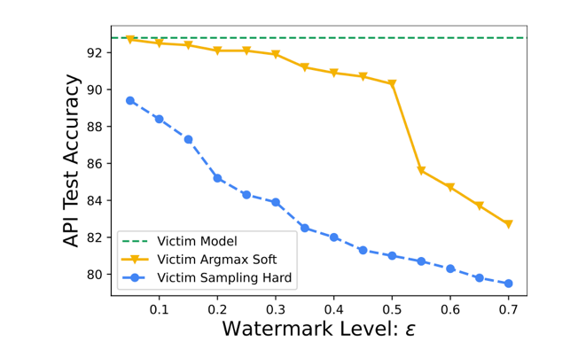
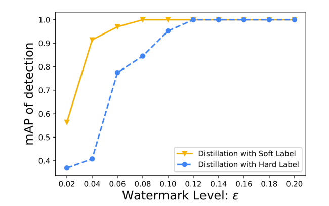
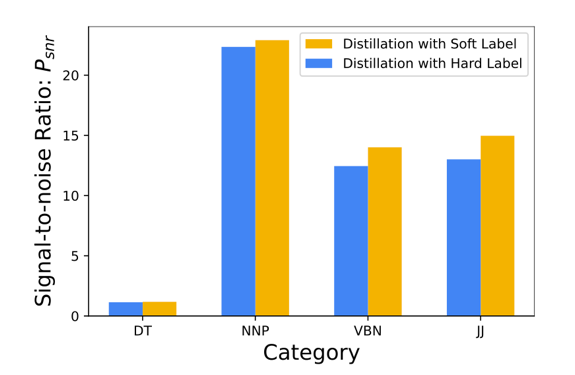
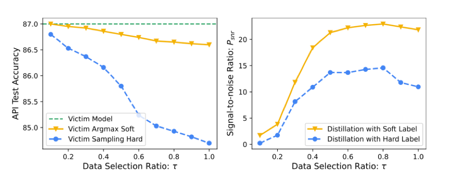

How to protect AI models from malicious use or being stolen? 

<!-- more -->

## Introduction

Natural language processing (NLP) is the branch of artificial intelligence that aims to bridge the language barrier between humans and computers by allowing computers to interpret and produce human language. Many NLP tasks, such as machine translation, summarization, text classification, and sequence labeling involve the use of neural networks, which take in large amounts of training data to statistically learn how to perform these tasks. Neural networks that have been trained on a specific task can be deployed as web services with pay-per-query APIs, allowing businesses to make use of them without undertaking the task of training the developing the model themselves.

Although these deployed NLP models provide a useful service to customers and businesses, there are significant challenges in providing the intellectual property of the creators of these models. Clients can use a process known as distillation to steal the parameters of the model to use for themselves. In this process, the attacker sends carefully designed queries to the API, specifically to learn the parameters of the model for malicious uses. Past attempts to prevent these attacks have involved the use of watermarking, in which a secret logo or signature is embedded in the model. In the event of a possible theft, a model owner can detect the watermark in the stolen model to establish ownership. However, these watermarks typically do not apply to NLP models, and they are invasive and fragile within their models. 

Recently Zhao et al presents the protection method of NLP models from distillation through Distillation-Resistant Watermarking (DRW), in a [paper][1] published at EMNLP 2022. DRW allows for training independence, flexibility, effectiveness, and scalability. This paper explains the technique behind DRW, as well as four tasks the researchers performed in order to evaluate its effectiveness. 

Paper: <https://arxiv.org/abs/2210.03312>
Code: <https://github.com/xuandongzhao/drw>

## DRW Overview

In DRW, a perturbation is introduced to the output of the proprietary model. In the case of a distillation attack, this perturbation will be transferred onto the suspect model, allowing the suspect model to be identified as stolen from the proprietary model. This is outlined in figure 1.
 

Figure 1: Model extraction and watermark detection

Proprietary models have two possible types of output: soft labels (real values such as probabilities) and hard labels. An adversary can query the model, obtain a pseudo-labeled dataset from the results, and train a new model with this dataset in order to create the stolen model. Adversaries can distill a proprietary model with hard labels by minimizing the cross-entropy loss or distill a proprietary model with soft labels by minimizing the Kullback-Liebler divergence loss.
With DRW, a watermark is dynamically embedded in query responses for theft detection. The following variables represent a key K:

<!--  -->

Taken together, these variables define a periodic signal function:

<!--  -->

where g is a hash function that projects a text representation to a scalar.

Next, the periodic signal for the victim output is given by

<!--  -->

where $\epsilon$ is the watermark level for the periodic signal and $p_c$ is the proprietary model’s prediction prior to watermarking. For soft labels, the proprietary model generates the output directly, while for hard labels, the proprietary model generates a one-hot label with probability for each class. In the case of hard labels, the watermark is retained through the expectation of the probabilities.

In order to detect the watermark in a suspect model, the Lomb-Scargle periodogram method for detecting period signals is used. It yields an estimate of the Fourier power spectrum at a given frequency, after which signal strength is evaluated by calculating the signal-to-noise ratio:

<!--  -->
 
A higher signal-to-noise ratio indicates a higher peak in the frequency domain, which can be used as evidence of theft.

The paper presents theoretical guarantees for DRW as well. In the soft label setting, if the water mark level is small, DRW does not have a large effect on accuracy. Furthermore, researchers derive an equation for the lower bound of accuracy in the hard label setting, allowing them to control the level to which watermarking affects the accuracy in that case as well.

## Experiments

The researchers evaluated DRW using four different tasks: Part-Of-Speech (POS) Tagging, Named Entity Recognition (NER), SST-2, and MRPC. BERT was used as the model backbone for each task. For each task, the protected proprietary model was trained to perform well on the validation set until it had comparable performance to BERT. Training data was split into two parts for soft and hard label distillation.

The existing state-of-the-art method, DeepJudge, quantitatively tests similarities between a proprietary model and suspect model. DeepJudge was modified by the researchers for use in texts and was used as the basis of comparison for DRW. For each task, researchers trained 10 extracted models from watermarked models, 10 extracted models from unwatermarked models, and 10 models from scratch. The method was evaluated with both distillation with soft labels and distillation with hard labels. DeepJudge performed well in detecting extracted models on SST-2 and MRPC tasks, but it could not do so for POS Tagging or NER. DRW successfully detected extraction across all tasks. DRW did cause a slight performance drop of within 5% of the proprietary model, with soft labels exhibiting less of a performance drop than hard labels.

The researchers additionally evaluated the watermark level necessary to ensure detection while minimizing the effect on accuracy. They did so by varying the watermark level in the SST-2 task and evaluating model accuracy and watermark detection. As expected, a higher watermark level leads to better detection but a lower model accuracy. The results are given in the graphs below:

Model accuracy on SST-2 task after watermark. 
<!--  -->

Detection rate with DRW.
<!--  -->

In another experiment, researchers designed 10 sets of ranking tasks, building 10 positive and 20 negative samples with a watermark level from 0.02 to 0.2. At a watermark level below 0.12, DRW could not perfectly detect positive and negative suspects.

Researchers also evaluated whether categories affect watermark protection. Watermarks were added to four different categories, and extracted models were trained using soft distillation and hard distillation. Results, shown below, indicate that the watermark has a greater effect when a category involves more samples.

<!--  -->

One final aspect of this model that researchers evaluated is how much of the proprietary model output should be watermarked. The researchers performed tasks while modifying the ratio of watermarked data. Similar to the watermark level, results (show below) show that model accuracy is negatively affected by a higher ratio, but watermark detection is improved. 

<!--  -->

## Limitations

This work has some limitations. Watermark detection does not work well when the watermarked data is only a small proportion of the training data set for the extracted model, and the method does not work well when the attacker only makes a few queries to the proprietary model. These limitations are both the result of limited watermark embedding in the extracted model, which prevents the detection of that watermark. Finally, if a proprietary model outputs soft labels, an adversary can get around watermarks by using the argmax operation to erase the watermark. 

## Summary

DRW presents a promising method of preventing the theft of intellectual property in NLP models. The use of a watermark in the output of NLP models will cause that watermark to be detectable in stolen models, given owners of the original model evidence in a potential legal case regarding the theft of their model. Although there are some limitations to this method, this paper demonstrates that it is an effective method of theft detection. This will help alleviate potential ethical concerns in deploying NLP models for use commercially, and it will help protect companies that distribute NLP web services.

## References

[1] Zhao, Xuandong, Li, Lei, Wang, Yu-Xiang. (2022). Distillation-Resistant Watermarking for Model Protection in NLP. EMNLP-Findings 2022, <https://arxiv.org/abs/2210.03312>

